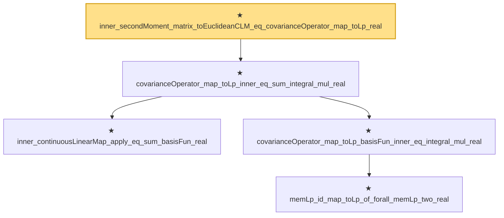

# Proof narrative — inner_secondMoment_matrix_toEuclideanCLM_eq_covarianceOperator_map_toLp_real

Root: **inner_secondMoment_matrix_toEuclideanCLM_eq_covarianceOperator_map_toLp_real** (theorem) `Statlib/StatFoundation/Convergence/AnalysisTools/IntegralConvergence.lean:1746` · topic `StatFoundation`
Closure: 5 declarations across 1 files. Generated from `proof_graph.json` — no files were moved.

Reading order (foundations first, headline last):

    ★ `inner_continuousLinearMap_apply_eq_sum_basisFun_real` — theorem · `Statlib/StatFoundation/Convergence/AnalysisTools/IntegralConvergence.lean:1686`
      ★ `memLp_id_map_toLp_of_forall_memLp_two_real` — theorem · `Statlib/StatFoundation/Convergence/AnalysisTools/IntegralConvergence.lean:1700`
    ★ `covarianceOperator_map_toLp_basisFun_inner_eq_integral_mul_real` — theorem · `Statlib/StatFoundation/Convergence/AnalysisTools/IntegralConvergence.lean:1710`  _(also used by 1: tendsto_covarianceOperator_map_toLp_basisFun_inner_of_pairwise_integral_mul_real)_
  ★ `covarianceOperator_map_toLp_inner_eq_sum_integral_mul_real` — theorem · `Statlib/StatFoundation/Convergence/AnalysisTools/IntegralConvergence.lean:1729`  _(also used by 1: tendsto_covarianceOperator_map_toLp_inner_of_pairwise_integral_mul_real)_
★ `inner_secondMoment_matrix_toEuclideanCLM_eq_covarianceOperator_map_toLp_real` — theorem · `Statlib/StatFoundation/Convergence/AnalysisTools/IntegralConvergence.lean:1746` **← headline**

## Dependency diagram

