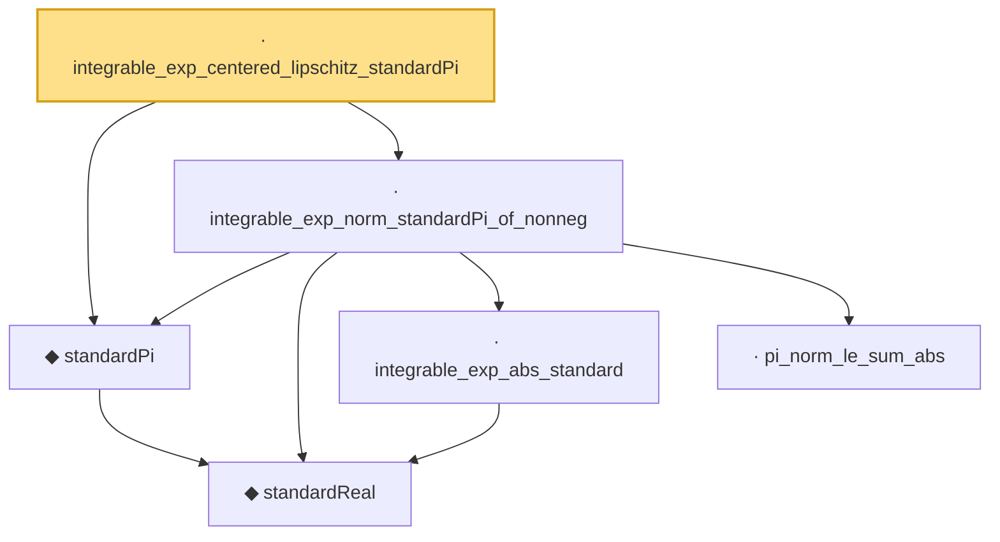

# Proof narrative — integrable_exp_centered_lipschitz_standardPi

Root: **integrable_exp_centered_lipschitz_standardPi** (lemma) `Statlib/StatFoundation/RandomVariable/Gaussian/Standard.lean:312` · topic `StatFoundation`
Closure: 6 declarations across 1 files. Generated from `proof_graph.json` — no files were moved.

Reading order (foundations first, headline last):

    ◆ `standardReal` — abbrev · `Statlib/StatFoundation/RandomVariable/Gaussian/Standard.lean:31`  _(also used by 46: memLp_aeval_intPolynomial_standard, integrable_aeval_intPolynomial_standard, memLp_hermite_eval_mul, …)_
  ◆ `standardPi` — def · `Statlib/StatFoundation/RandomVariable/Gaussian/Standard.lean:34`  _(also used by 6: standardPi_absolutelyContinuous, integrable_id_standardPi, integrable_lipschitz_standardPi, …)_
    · `integrable_exp_abs_standard` — lemma · `Statlib/StatFoundation/RandomVariable/Gaussian/Standard.lean:239`  _(also used by 1: integral_cexp_mul_eq_zero_of_moments)_
    · `pi_norm_le_sum_abs` — lemma · `Statlib/StatFoundation/RandomVariable/Gaussian/Standard.lean:272`
  · `integrable_exp_norm_standardPi_of_nonneg` — lemma · `Statlib/StatFoundation/RandomVariable/Gaussian/Standard.lean:281`
· `integrable_exp_centered_lipschitz_standardPi` — lemma · `Statlib/StatFoundation/RandomVariable/Gaussian/Standard.lean:312` **← headline**

## Dependency diagram

