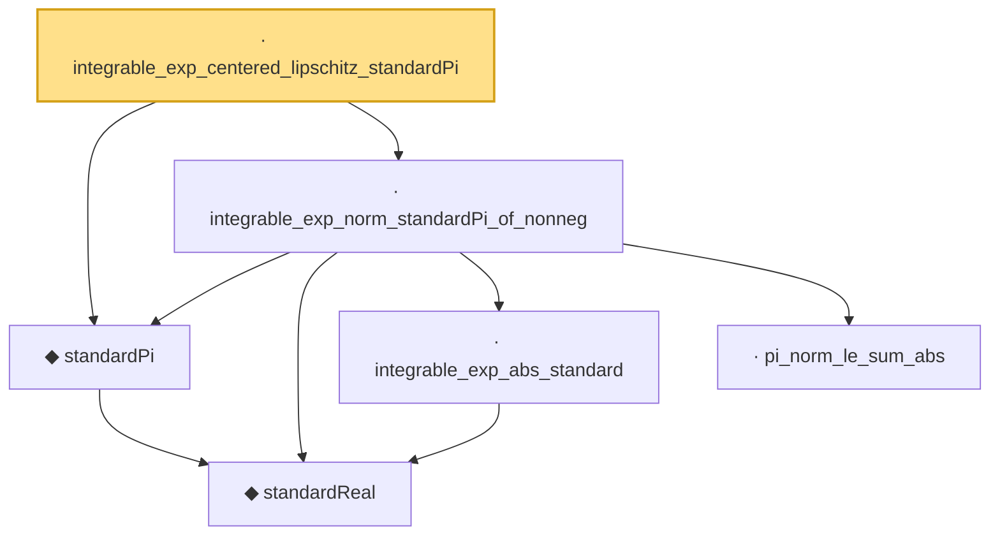

# Proof narrative — integrable_exp_centered_lipschitz_standardPi

Root: **integrable_exp_centered_lipschitz_standardPi** (lemma) `Statlib/StatFoundation/RandomVariable/Gaussian/Standard.lean:312` · topic `StatFoundation`
Closure: 6 declarations across 1 files. Generated from `proof_graph.json` — no files were moved.

Reading order (foundations first, headline last):

    ◆ `standardReal` — abbrev · `Statlib/StatFoundation/RandomVariable/Gaussian/Standard.lean:31`  _(also used by 79: single_square_law, wald_statistic_asymptotic_chisq1, score_statistic_asymptotic_chisq1, …)_
  ◆ `standardPi` — def · `Statlib/StatFoundation/RandomVariable/Gaussian/Standard.lean:34`  _(also used by 22: one_sample_t_test, standardPi_sFinite, standardPi_logSobolev_smooth_finiteFisher, …)_
    · `integrable_exp_abs_standard` — lemma · `Statlib/StatFoundation/RandomVariable/Gaussian/Standard.lean:239`  _(also used by 6: integral_cexp_mul_eq_zero_of_moments, euclideanStandardGaussian_integrable_exp_of_lipschitz, standardReal_logSobolev_smooth_normalized_finiteFisher, …)_
    · `pi_norm_le_sum_abs` — lemma · `Statlib/StatFoundation/RandomVariable/Gaussian/Standard.lean:272`  _(also used by 1: standardPi_logSobolev_smooth_finiteFisher_coord)_
  · `integrable_exp_norm_standardPi_of_nonneg` — lemma · `Statlib/StatFoundation/RandomVariable/Gaussian/Standard.lean:281`  _(also used by 4: standardPi_logSobolev_smooth_finiteFisher, standardPi_logSobolev_smooth_finiteFisher_coord, standardGaussian_logSobolev_exp_smooth, …)_
· `integrable_exp_centered_lipschitz_standardPi` — lemma · `Statlib/StatFoundation/RandomVariable/Gaussian/Standard.lean:312` **← headline**

## Dependency diagram

```mermaid
flowchart TD
  n0["◆ standardReal"]
  n1["◆ standardPi"]
  n2["· integrable_exp_abs_standard"]
  n3["· pi_norm_le_sum_abs"]
  n4["· integrable_exp_norm_standardPi_of_nonneg"]
  n5["· integrable_exp_centered_lipschitz_standardPi"]
  n1 --> n0
  n2 --> n0
  n4 --> n1
  n4 --> n0
  n4 --> n2
  n4 --> n3
  n5 --> n1
  n5 --> n4
  class n5 headline;
  classDef headline fill:#ffe08a,stroke:#d4a017,stroke-width:2px;
  classDef axiomNode fill:#ffd0d0,stroke:#c0392b,stroke-dasharray:4 2;
```
