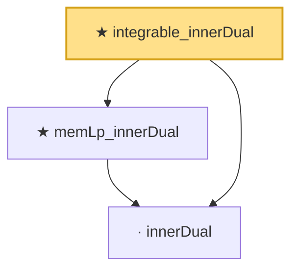

# Proof narrative — integrable_innerDual

Root: **integrable_innerDual** (private theorem) `Statlib/StatFoundation/RandomVariable/Gaussian/HilbertSpace.lean:175` · topic `StatFoundation`
Closure: 3 declarations across 1 files. Generated from `proof_graph.json` — no files were moved.

Reading order (foundations first, headline last):

  · `innerDual` — private noncomputable def · `Statlib/StatFoundation/RandomVariable/Gaussian/HilbertSpace.lean:166`  _(also used by 3: integrable_innerDual_mul, covarianceBilinearForm, covarianceBilinearForm_self_eq_variance)_
  ★ `memLp_innerDual` — private theorem · `Statlib/StatFoundation/RandomVariable/Gaussian/HilbertSpace.lean:170`  _(also used by 2: integrable_innerDual_mul, covarianceBilinearForm_self_eq_variance)_
★ `integrable_innerDual` — private theorem · `Statlib/StatFoundation/RandomVariable/Gaussian/HilbertSpace.lean:175` **← headline**

## Dependency diagram

