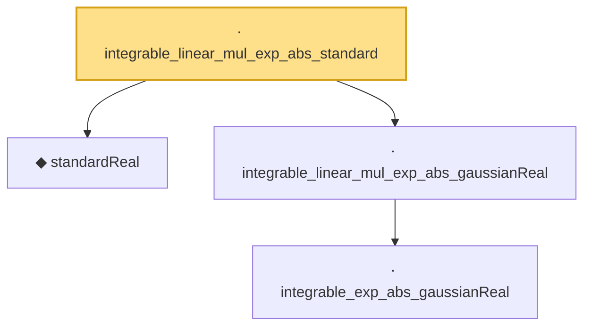

# Proof narrative — integrable_linear_mul_exp_abs_standard

Root: **integrable_linear_mul_exp_abs_standard** (lemma) `Statlib/StatFoundation/RandomVariable/Gaussian/LogSobolev.lean:755` · topic `StatFoundation`
Closure: 4 declarations across 2 files. Generated from `proof_graph.json` — no files were moved.

Reading order (foundations first, headline last):

  ◆ `standardReal` — abbrev · `Statlib/StatFoundation/RandomVariable/Gaussian/Standard.lean:31`  _(also used by 48: memLp_aeval_intPolynomial_standard, integrable_aeval_intPolynomial_standard, memLp_hermite_eval_mul, …)_
    · `integrable_exp_abs_gaussianReal` — lemma · `Statlib/StatFoundation/RandomVariable/Gaussian/LogSobolev.lean:652`  _(also used by 1: integrable_quadratic_mul_exp_abs_gaussianReal)_
  · `integrable_linear_mul_exp_abs_gaussianReal` — lemma · `Statlib/StatFoundation/RandomVariable/Gaussian/LogSobolev.lean:681`  _(also used by 1: integrable_linear_mul_exp_abs_mul_gaussianPDFReal)_
· `integrable_linear_mul_exp_abs_standard` — lemma · `Statlib/StatFoundation/RandomVariable/Gaussian/LogSobolev.lean:755` **← headline**

## Dependency diagram

