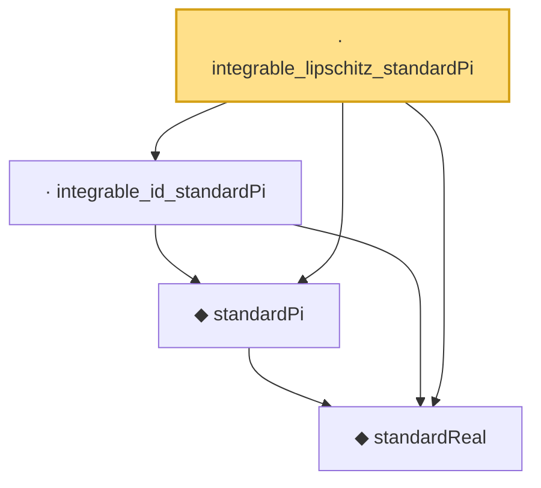

# Proof narrative — integrable_lipschitz_standardPi

Root: **integrable_lipschitz_standardPi** (lemma) `Statlib/StatFoundation/RandomVariable/Gaussian/Standard.lean:211` · topic `StatFoundation`
Closure: 4 declarations across 1 files. Generated from `proof_graph.json` — no files were moved.

Reading order (foundations first, headline last):

  ◆ `standardReal` — abbrev · `Statlib/StatFoundation/RandomVariable/Gaussian/Standard.lean:31`  _(also used by 46: memLp_aeval_intPolynomial_standard, integrable_aeval_intPolynomial_standard, memLp_hermite_eval_mul, …)_
  ◆ `standardPi` — def · `Statlib/StatFoundation/RandomVariable/Gaussian/Standard.lean:34`  _(also used by 6: standardPi_absolutelyContinuous, integrable_exp_norm_standardPi_of_nonneg, integrable_exp_centered_lipschitz_standardPi, …)_
  · `integrable_id_standardPi` — lemma · `Statlib/StatFoundation/RandomVariable/Gaussian/Standard.lean:197`  _(also used by 1: standardPi_integration_by_parts_coord)_
· `integrable_lipschitz_standardPi` — lemma · `Statlib/StatFoundation/RandomVariable/Gaussian/Standard.lean:211` **← headline**

## Dependency diagram

