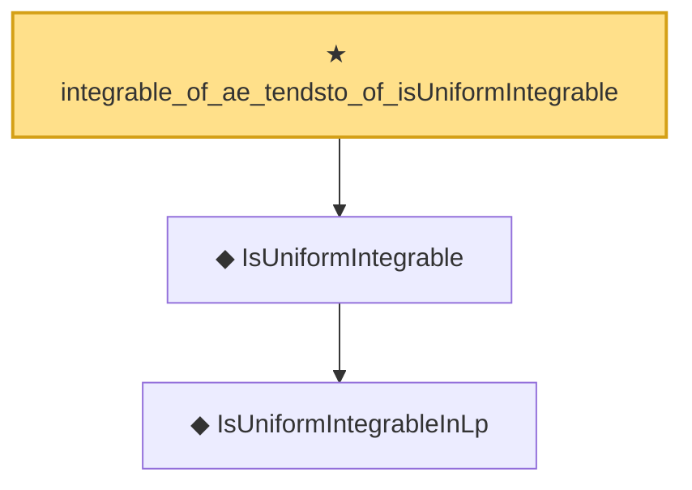

# Proof narrative — integrable_of_ae_tendsto_of_isUniformIntegrable

Root: **integrable_of_ae_tendsto_of_isUniformIntegrable** (theorem) `Statlib/StatFoundation/Convergence/AnalysisTools/UniformIntegrability.lean:255` · topic `StatFoundation`
Closure: 3 declarations across 2 files. Generated from `proof_graph.json` — no files were moved.

Reading order (foundations first, headline last):

    ◆ `IsUniformIntegrableInLp` — abbrev · `Statlib/StatFoundation/Vocabulary/UniformIntegrability.lean:53`  _(also used by 39: memLp_two_of_inProbabilityConvergence_of_isUniformIntegrableInLp_two, inLpConvergence_two_of_inProbabilityConvergence_of_isUniformIntegrableInLp_two, tendsto_integral_of_inProbabilityConvergence_of_isUniformIntegrableInLp_two, …)_
  ◆ `IsUniformIntegrable` — abbrev · `Statlib/StatFoundation/Vocabulary/UniformIntegrability.lean:59`  _(also used by 13: tendsto_integral_of_inProbabilityConvergence_of_isUniformIntegrable, tendsto_norm_integral_sub_zero_of_inProbabilityConvergence_of_isUniformIntegrable, tendsto_integral_continuousLinearMap_of_inProbabilityConvergence_of_isUniformIntegrable, …)_
★ `integrable_of_ae_tendsto_of_isUniformIntegrable` — theorem · `Statlib/StatFoundation/Convergence/AnalysisTools/UniformIntegrability.lean:255` **← headline**

## Dependency diagram

