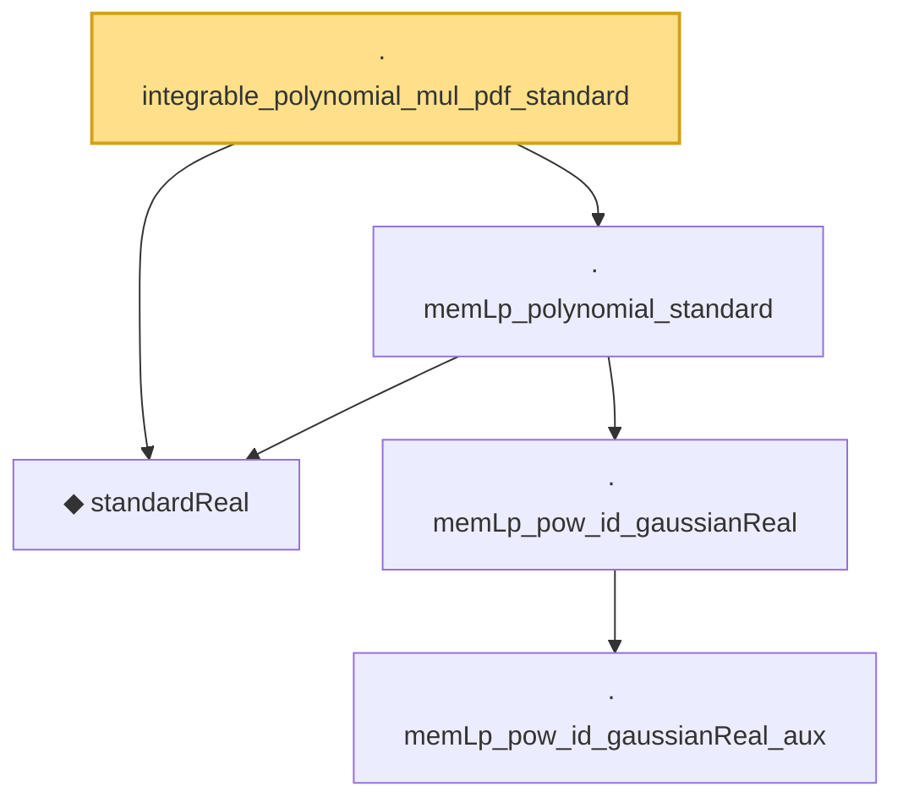

# Proof narrative — integrable_polynomial_mul_pdf_standard

Root: **integrable_polynomial_mul_pdf_standard** (lemma) `Statlib/StatFoundation/RandomVariable/Gaussian/Standard.lean:162` · topic `StatFoundation`
Closure: 5 declarations across 1 files. Generated from `proof_graph.json` — no files were moved.

Reading order (foundations first, headline last):

  ◆ `standardReal` — abbrev · `Statlib/StatFoundation/RandomVariable/Gaussian/Standard.lean:31`  _(also used by 33: memLp_aeval_intPolynomial_standard, integrable_aeval_intPolynomial_standard, memLp_hermite_eval_mul, …)_
      · `memLp_pow_id_gaussianReal_aux` — private lemma · `Statlib/StatFoundation/RandomVariable/Gaussian/Standard.lean:114`
    · `memLp_pow_id_gaussianReal` — lemma · `Statlib/StatFoundation/RandomVariable/Gaussian/Standard.lean:139`
  · `memLp_polynomial_standard` — lemma · `Statlib/StatFoundation/RandomVariable/Gaussian/Standard.lean:144`  _(also used by 2: memLp_aeval_intPolynomial_standard, integrable_mul_polynomial_of_memLp_standard)_
· `integrable_polynomial_mul_pdf_standard` — lemma · `Statlib/StatFoundation/RandomVariable/Gaussian/Standard.lean:162` **← headline**

## Dependency diagram

