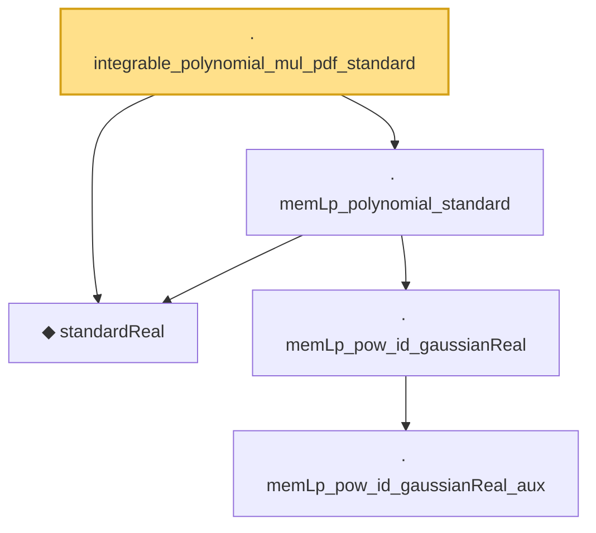

# Proof narrative — integrable_polynomial_mul_pdf_standard

Root: **integrable_polynomial_mul_pdf_standard** (lemma) `Statlib/StatFoundation/RandomVariable/Gaussian/Standard.lean:162` · topic `StatFoundation`
Closure: 5 declarations across 1 files. Generated from `proof_graph.json` — no files were moved.

Reading order (foundations first, headline last):

  ◆ `standardReal` — abbrev · `Statlib/StatFoundation/RandomVariable/Gaussian/Standard.lean:31`  _(also used by 80: single_square_law, wald_statistic_asymptotic_chisq1, score_statistic_asymptotic_chisq1, …)_
      · `memLp_pow_id_gaussianReal_aux` — private lemma · `Statlib/StatFoundation/RandomVariable/Gaussian/Standard.lean:114`
    · `memLp_pow_id_gaussianReal` — lemma · `Statlib/StatFoundation/RandomVariable/Gaussian/Standard.lean:139`  _(also used by 11: standardReal_integrable_mul_log_of_pos_contDiff_deriv_bounded, standardReal_integrationByParts_smooth_bddDeriv, standardReal_ou_mehler_semigroup, …)_
  · `memLp_polynomial_standard` — lemma · `Statlib/StatFoundation/RandomVariable/Gaussian/Standard.lean:144`  _(also used by 4: memLp_aeval_intPolynomial_standard, integrable_mul_polynomial_of_memLp_standard, standardReal_logSobolev_smooth_normalized_finiteFisher, …)_
· `integrable_polynomial_mul_pdf_standard` — lemma · `Statlib/StatFoundation/RandomVariable/Gaussian/Standard.lean:162` **← headline**

## Dependency diagram

```mermaid
flowchart TD
  n0["◆ standardReal"]
  n1["· memLp_pow_id_gaussianReal_aux"]
  n2["· memLp_pow_id_gaussianReal"]
  n3["· memLp_polynomial_standard"]
  n4["· integrable_polynomial_mul_pdf_standard"]
  n2 --> n1
  n3 --> n0
  n3 --> n2
  n4 --> n0
  n4 --> n3
  class n4 headline;
  classDef headline fill:#ffe08a,stroke:#d4a017,stroke-width:2px;
  classDef axiomNode fill:#ffd0d0,stroke:#c0392b,stroke-dasharray:4 2;
```
