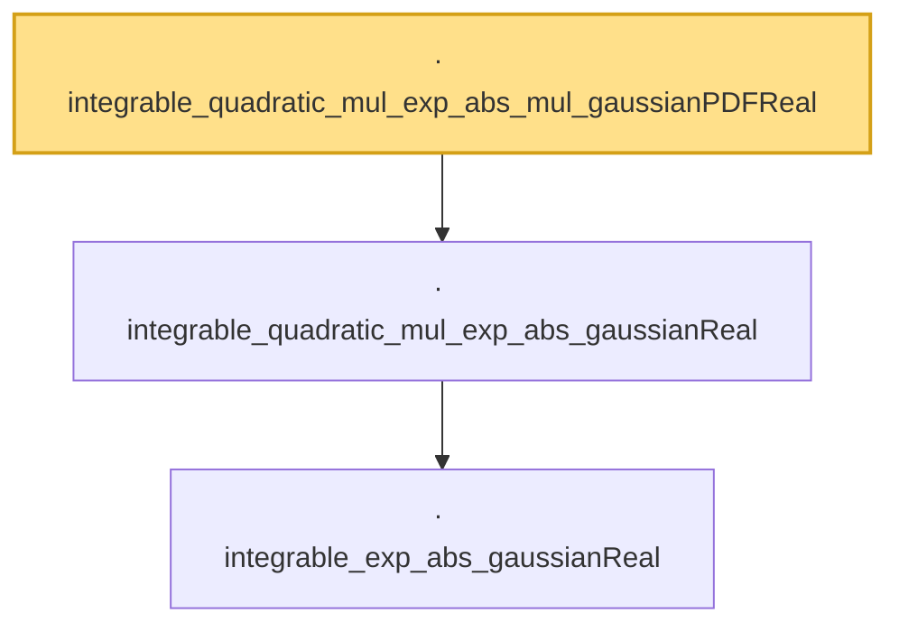

# Proof narrative — integrable_quadratic_mul_exp_abs_mul_gaussianPDFReal

Root: **integrable_quadratic_mul_exp_abs_mul_gaussianPDFReal** (lemma) `Statlib/StatFoundation/RandomVariable/Gaussian/LogSobolev.lean:869` · topic `StatFoundation`
Closure: 3 declarations across 1 files. Generated from `proof_graph.json` — no files were moved.

Reading order (foundations first, headline last):

    · `integrable_exp_abs_gaussianReal` — lemma · `Statlib/StatFoundation/RandomVariable/Gaussian/LogSobolev.lean:652`  _(also used by 1: integrable_linear_mul_exp_abs_gaussianReal)_
  · `integrable_quadratic_mul_exp_abs_gaussianReal` — lemma · `Statlib/StatFoundation/RandomVariable/Gaussian/LogSobolev.lean:777`
· `integrable_quadratic_mul_exp_abs_mul_gaussianPDFReal` — lemma · `Statlib/StatFoundation/RandomVariable/Gaussian/LogSobolev.lean:869` **← headline**

## Dependency diagram

