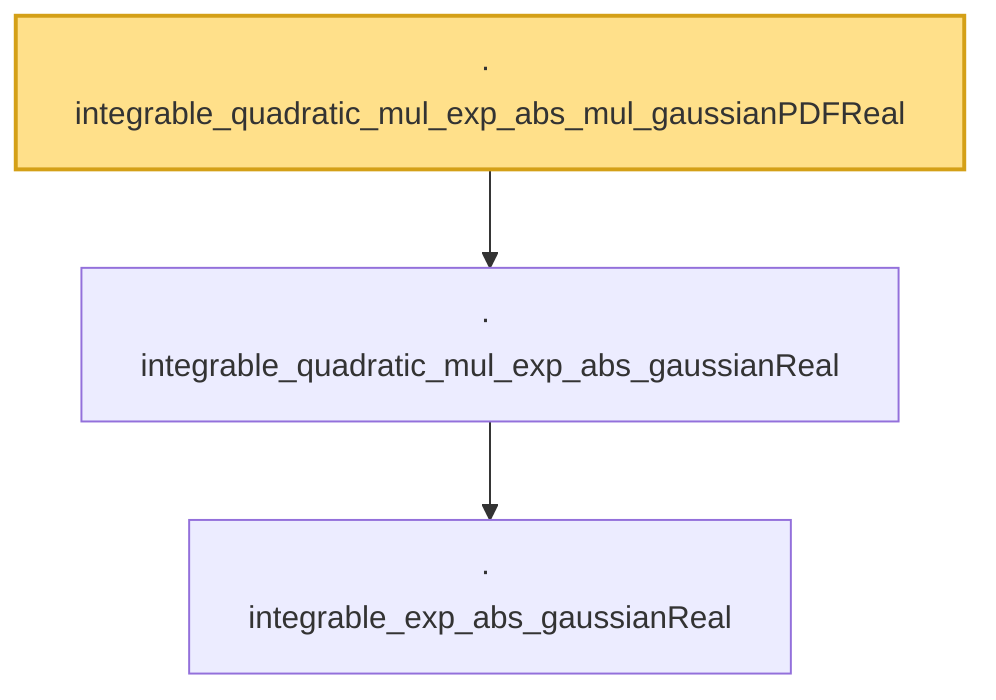

# Proof narrative — integrable_quadratic_mul_exp_abs_mul_gaussianPDFReal

Root: **integrable_quadratic_mul_exp_abs_mul_gaussianPDFReal** (lemma) `Statlib/StatFoundation/RandomVariable/Gaussian/LogSobolev.lean:876` · topic `StatFoundation`
Closure: 3 declarations across 1 files. Generated from `proof_graph.json` — no files were moved.

Reading order (foundations first, headline last):

    · `integrable_exp_abs_gaussianReal` — lemma · `Statlib/StatFoundation/RandomVariable/Gaussian/LogSobolev.lean:659`  _(also used by 1: integrable_linear_mul_exp_abs_gaussianReal)_
  · `integrable_quadratic_mul_exp_abs_gaussianReal` — lemma · `Statlib/StatFoundation/RandomVariable/Gaussian/LogSobolev.lean:784`  _(also used by 2: standardReal_ou_mehler_entropy_ibp_pos, gaussianMollifier_fderiv_tendsto_ae_of_lipschitz)_
· `integrable_quadratic_mul_exp_abs_mul_gaussianPDFReal` — lemma · `Statlib/StatFoundation/RandomVariable/Gaussian/LogSobolev.lean:876` **← headline**

## Dependency diagram

```mermaid
flowchart TD
  n0["· integrable_exp_abs_gaussianReal"]
  n1["· integrable_quadratic_mul_exp_abs_gaussianReal"]
  n2["· integrable_quadratic_mul_exp_abs_mul_gaussianPDFReal"]
  n1 --> n0
  n2 --> n1
  class n2 headline;
  classDef headline fill:#ffe08a,stroke:#d4a017,stroke-width:2px;
  classDef axiomNode fill:#ffd0d0,stroke:#c0392b,stroke-dasharray:4 2;
```
