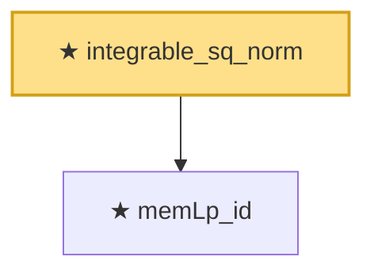

# Proof narrative — integrable_sq_norm

Root: **integrable_sq_norm** (theorem) `Statlib/StatFoundation/RandomVariable/Gaussian/HilbertSpace.lean:259` · topic `StatFoundation`
Closure: 2 declarations across 1 files. Generated from `proof_graph.json` — no files were moved.

Reading order (foundations first, headline last):

  ★ `memLp_id` — theorem · `Statlib/StatFoundation/RandomVariable/Gaussian/HilbertSpace.lean:248`
★ `integrable_sq_norm` — theorem · `Statlib/StatFoundation/RandomVariable/Gaussian/HilbertSpace.lean:259` **← headline**

## Dependency diagram

