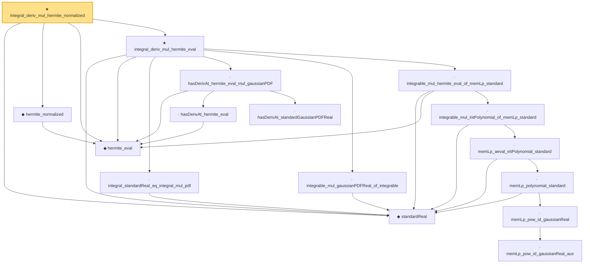

# Proof narrative — integral_deriv_mul_hermite_normalized

Root: **integral_deriv_mul_hermite_normalized** (theorem) `Statlib/StatFoundation/RandomVariable/Gaussian/Hermite.lean:407` · topic `StatFoundation`
Closure: 16 declarations across 2 files. Generated from `proof_graph.json` — no files were moved.

Reading order (foundations first, headline last):

  ◆ `standardReal` — abbrev · `Statlib/StatFoundation/RandomVariable/Gaussian/Standard.lean:31`  _(also used by 41: integrable_aeval_intPolynomial_standard, memLp_hermite_eval_mul, memLp_deriv_hermite_eval_mul, …)_
  ◆ `hermite_eval` — abbrev · `Statlib/StatFoundation/RandomVariable/Gaussian/Hermite.lean:58`  _(also used by 10: hasDerivAt_hermite_eval_mul, memLp_hermite_eval_mul, memLp_deriv_hermite_eval_mul, …)_
  ◆ `hermite_normalized` — noncomputable def · `Statlib/StatFoundation/RandomVariable/Gaussian/Hermite.lean:219`  _(also used by 3: hermite_normalized_eq, integral_hermite_normalized_mul_eq, hermite_normalized_recurrence)_
    · `integral_standardReal_eq_integral_mul_pdf` — private lemma · `Statlib/StatFoundation/RandomVariable/Gaussian/Hermite.lean:349`
      · `hasDerivAt_hermite_eval` — lemma · `Statlib/StatFoundation/RandomVariable/Gaussian/Hermite.lean:60`  _(also used by 2: hasDerivAt_hermite_eval_mul, integral_hermite_eval_eq_zero)_
      · `hasDerivAt_standardGaussianPDFReal` — lemma · `Statlib/StatFoundation/RandomVariable/Gaussian/Standard.lean:178`  _(also used by 1: standard_stein_identity)_
    · `hasDerivAt_hermite_eval_mul_gaussianPDF` — private lemma · `Statlib/StatFoundation/RandomVariable/Gaussian/Hermite.lean:335`
    · `integrable_mul_gaussianPDFReal_of_integrable` — private lemma · `Statlib/StatFoundation/RandomVariable/Gaussian/Hermite.lean:320`
            · `memLp_pow_id_gaussianReal_aux` — private lemma · `Statlib/StatFoundation/RandomVariable/Gaussian/Standard.lean:114`
            · `memLp_pow_id_gaussianReal` — lemma · `Statlib/StatFoundation/RandomVariable/Gaussian/Standard.lean:139`  _(also used by 4: standardReal_integrable_mul_log_of_pos_contDiff_deriv_bounded, standardReal_integrationByParts_smooth_bddDeriv, standardReal_ou_mehler_log_growth_local_pos, …)_
          · `memLp_polynomial_standard` — lemma · `Statlib/StatFoundation/RandomVariable/Gaussian/Standard.lean:144`  _(also used by 2: integrable_mul_polynomial_of_memLp_standard, integrable_polynomial_mul_pdf_standard)_
        · `memLp_aeval_intPolynomial_standard` — lemma · `Statlib/StatFoundation/RandomVariable/Gaussian/Hermite.lean:43`  _(also used by 4: integrable_aeval_intPolynomial_standard, memLp_hermite_eval_mul, memLp_deriv_hermite_eval_mul, …)_
      · `integrable_mul_intPolynomial_of_memLp_standard` — lemma · `Statlib/StatFoundation/RandomVariable/Gaussian/Hermite.lean:292`  _(also used by 3: integral_cexp_mul_eq_zero_of_moments, integral_poly_mul_g_of_moments_below, hermite_span_dense_L2_standard)_
    · `integrable_mul_hermite_eval_of_memLp_standard` — lemma · `Statlib/StatFoundation/RandomVariable/Gaussian/Hermite.lean:311`  _(also used by 1: hermite_span_dense_L2_standard)_
  ★ `integral_deriv_mul_hermite_eval` — theorem · `Statlib/StatFoundation/RandomVariable/Gaussian/Hermite.lean:365`
★ `integral_deriv_mul_hermite_normalized` — theorem · `Statlib/StatFoundation/RandomVariable/Gaussian/Hermite.lean:407` **← headline**

## Dependency diagram

