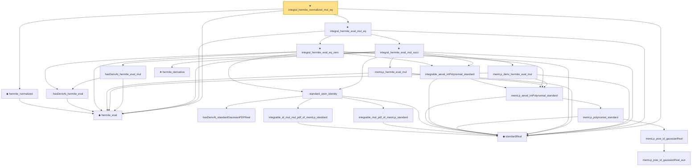

# Proof narrative — integral_hermite_normalized_mul_eq

Root: **integral_hermite_normalized_mul_eq** (theorem) `Statlib/StatFoundation/RandomVariable/Gaussian/Hermite.lean:226` · topic `StatFoundation`
Closure: 21 declarations across 3 files. Generated from `proof_graph.json` — no files were moved.

Reading order (foundations first, headline last):

  ◆ `hermite_eval` — abbrev · `Statlib/StatFoundation/RandomVariable/Gaussian/Hermite.lean:58`  _(also used by 7: hermite_normalized_eq, hermite_normalized_recurrence, integrable_mul_hermite_eval_of_memLp_standard, …)_
  ◆ `hermite_normalized` — noncomputable def · `Statlib/StatFoundation/RandomVariable/Gaussian/Hermite.lean:219`  _(also used by 3: hermite_normalized_eq, hermite_normalized_recurrence, integral_deriv_mul_hermite_normalized)_
  ◆ `standardReal` — abbrev · `Statlib/StatFoundation/RandomVariable/Gaussian/Standard.lean:31`  _(also used by 23: integrable_mul_intPolynomial_of_memLp_standard, integrable_mul_polynomial_of_memLp_standard, integrable_mul_hermite_eval_of_memLp_standard, …)_
        · `hasDerivAt_standardGaussianPDFReal` — lemma · `Statlib/StatFoundation/RandomVariable/Gaussian/Standard.lean:178`  _(also used by 1: hasDerivAt_hermite_eval_mul_gaussianPDF)_
        · `integrable_id_mul_mul_pdf_of_memLp_standard` — lemma · `Statlib/StatFoundation/RandomVariable/Gaussian/Standard.lean:96`
        · `integrable_mul_pdf_of_memLp_standard` — lemma · `Statlib/StatFoundation/RandomVariable/Gaussian/Standard.lean:84`
      · `standard_stein_identity` — lemma · `Statlib/StatFoundation/RandomVariable/Gaussian/Stein.lean:25`  _(also used by 1: standard_stein_identity_of_lipschitz)_
            · `memLp_pow_id_gaussianReal_aux` — private lemma · `Statlib/StatFoundation/RandomVariable/Gaussian/Standard.lean:114`
          · `memLp_pow_id_gaussianReal` — lemma · `Statlib/StatFoundation/RandomVariable/Gaussian/Standard.lean:139`
        · `memLp_polynomial_standard` — lemma · `Statlib/StatFoundation/RandomVariable/Gaussian/Standard.lean:144`  _(also used by 2: integrable_mul_polynomial_of_memLp_standard, integrable_polynomial_mul_pdf_standard)_
      · `memLp_aeval_intPolynomial_standard` — lemma · `Statlib/StatFoundation/RandomVariable/Gaussian/Hermite.lean:43`  _(also used by 1: integrable_mul_intPolynomial_of_memLp_standard)_
      · `hasDerivAt_hermite_eval` — lemma · `Statlib/StatFoundation/RandomVariable/Gaussian/Hermite.lean:60`  _(also used by 1: hasDerivAt_hermite_eval_mul_gaussianPDF)_
      · `integrable_aeval_intPolynomial_standard` — lemma · `Statlib/StatFoundation/RandomVariable/Gaussian/Hermite.lean:52`
    ★ `integral_hermite_eval_eq_zero` — theorem · `Statlib/StatFoundation/RandomVariable/Gaussian/Hermite.lean:102`
      · `memLp_hermite_eval_mul` — lemma · `Statlib/StatFoundation/RandomVariable/Gaussian/Hermite.lean:71`
      · `memLp_deriv_hermite_eval_mul` — lemma · `Statlib/StatFoundation/RandomVariable/Gaussian/Hermite.lean:79`
      · `hasDerivAt_hermite_eval_mul` — lemma · `Statlib/StatFoundation/RandomVariable/Gaussian/Hermite.lean:65`
      ★ `hermite_derivative` — theorem · `Statlib/StatFoundation/RandomVariable/Gaussian/Hermite.lean:24`  _(also used by 1: hermite_normalized_recurrence)_
    ★ `integral_hermite_eval_mul_succ` — theorem · `Statlib/StatFoundation/RandomVariable/Gaussian/Hermite.lean:128`
  ★ `integral_hermite_eval_mul_eq` — theorem · `Statlib/StatFoundation/RandomVariable/Gaussian/Hermite.lean:182`
★ `integral_hermite_normalized_mul_eq` — theorem · `Statlib/StatFoundation/RandomVariable/Gaussian/Hermite.lean:226` **← headline**

## Dependency diagram

