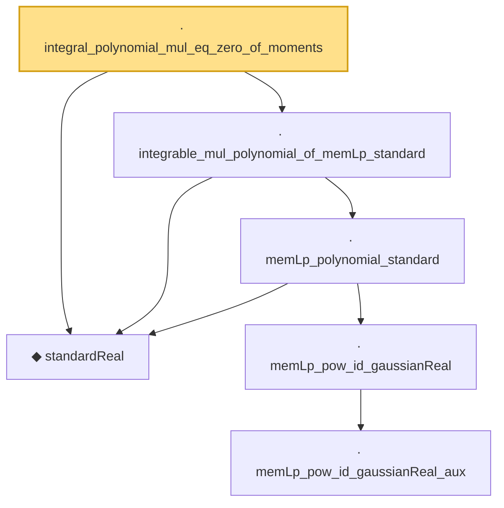

# Proof narrative — integral_polynomial_mul_eq_zero_of_moments

Root: **integral_polynomial_mul_eq_zero_of_moments** (lemma) `Statlib/StatFoundation/RandomVariable/Gaussian/Hermite.lean:437` · topic `StatFoundation`
Closure: 6 declarations across 2 files. Generated from `proof_graph.json` — no files were moved.

Reading order (foundations first, headline last):

  ◆ `standardReal` — abbrev · `Statlib/StatFoundation/RandomVariable/Gaussian/Standard.lean:31`  _(also used by 46: memLp_aeval_intPolynomial_standard, integrable_aeval_intPolynomial_standard, memLp_hermite_eval_mul, …)_
        · `memLp_pow_id_gaussianReal_aux` — private lemma · `Statlib/StatFoundation/RandomVariable/Gaussian/Standard.lean:114`
      · `memLp_pow_id_gaussianReal` — lemma · `Statlib/StatFoundation/RandomVariable/Gaussian/Standard.lean:139`  _(also used by 4: standardReal_integrable_mul_log_of_pos_contDiff_deriv_bounded, standardReal_integrationByParts_smooth_bddDeriv, standardReal_ou_mehler_log_growth_local_pos, …)_
    · `memLp_polynomial_standard` — lemma · `Statlib/StatFoundation/RandomVariable/Gaussian/Standard.lean:144`  _(also used by 2: memLp_aeval_intPolynomial_standard, integrable_polynomial_mul_pdf_standard)_
  · `integrable_mul_polynomial_of_memLp_standard` — lemma · `Statlib/StatFoundation/RandomVariable/Gaussian/Hermite.lean:302`  _(also used by 1: standardReal_integrationByParts_smooth_bddDeriv)_
· `integral_polynomial_mul_eq_zero_of_moments` — lemma · `Statlib/StatFoundation/RandomVariable/Gaussian/Hermite.lean:437` **← headline**

## Dependency diagram

