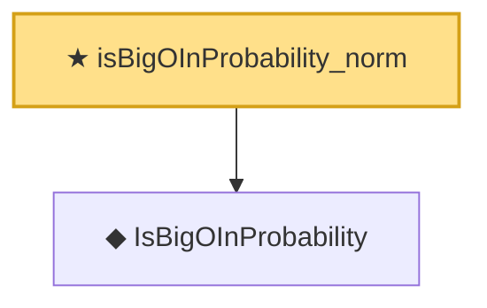

# Proof narrative — isBigOInProbability_norm

Root: **isBigOInProbability_norm** (theorem) `Statlib/StatFoundation/Convergence/AnalysisTools/StochasticOrder/AlgebraMap.lean:151` · topic `StatFoundation`
Closure: 2 declarations across 2 files. Generated from `proof_graph.json` — no files were moved.

Reading order (foundations first, headline last):

  ◆ `IsBigOInProbability` — def · `Statlib/StatFoundation/Vocabulary/StochasticOrder.lean:48`  _(also used by 55: isBigOInProbability_add, isBigOInProbability_smul_rate, isBigOInProbability_mul_rate, …)_
★ `isBigOInProbability_norm` — theorem · `Statlib/StatFoundation/Convergence/AnalysisTools/StochasticOrder/AlgebraMap.lean:151` **← headline**

## Dependency diagram

