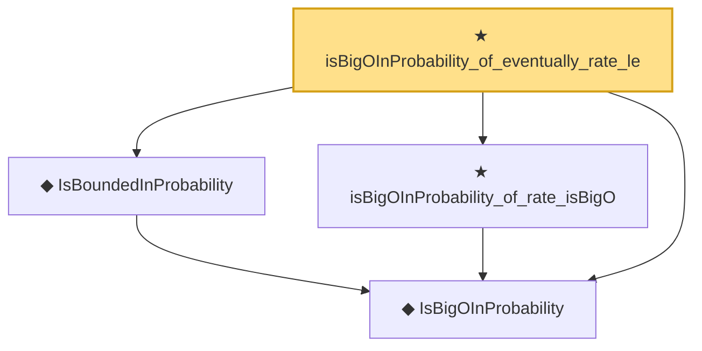

# Proof narrative — isBigOInProbability_of_eventually_rate_le

Root: **isBigOInProbability_of_eventually_rate_le** (theorem) `Statlib/StatFoundation/Convergence/AnalysisTools/StochasticOrder/RateBounds.lean:15` · topic `StatFoundation`
Closure: 4 declarations across 3 files. Generated from `proof_graph.json` — no files were moved.

Reading order (foundations first, headline last):

  ◆ `IsBigOInProbability` — def · `Statlib/StatFoundation/Vocabulary/StochasticOrder.lean:48`  _(also used by 53: isBigOInProbability_add, isBigOInProbability_smul_rate, isBigOInProbability_mul_rate, …)_
  ◆ `IsBoundedInProbability` — abbrev · `Statlib/StatFoundation/Vocabulary/StochasticOrder.lean:64`  _(also used by 7: isBoundedInProbability_iff_isBigOInProbability_one, isBoundedInProbability_of_isBigOInProbability_tendsto_zero, isBoundedInProbability_of_isBigOInProbability_rate_isBigO_one, …)_
  ★ `isBigOInProbability_of_rate_isBigO` — theorem · `Statlib/StatFoundation/Convergence/AnalysisTools/StochasticOrder/RateBig.lean:11`  _(also used by 1: isBoundedInProbability_of_isBigOInProbability_rate_isBigO_one)_
★ `isBigOInProbability_of_eventually_rate_le` — theorem · `Statlib/StatFoundation/Convergence/AnalysisTools/StochasticOrder/RateBounds.lean:15` **← headline**

## Dependency diagram

