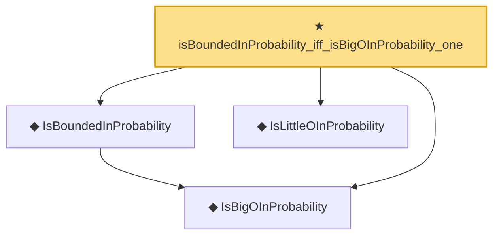

# Proof narrative — isBoundedInProbability_iff_isBigOInProbability_one

Root: **isBoundedInProbability_iff_isBigOInProbability_one** (theorem) `Statlib/StatFoundation/Convergence/AnalysisTools/StochasticOrder/Basic.lean:168` · topic `StatFoundation`
Closure: 4 declarations across 2 files. Generated from `proof_graph.json` — no files were moved.

Reading order (foundations first, headline last):

  ◆ `IsBigOInProbability` — def · `Statlib/StatFoundation/Vocabulary/StochasticOrder.lean:48`  _(also used by 54: isBigOInProbability_add, isBigOInProbability_smul_rate, isBigOInProbability_mul_rate, …)_
  ◆ `IsBoundedInProbability` — abbrev · `Statlib/StatFoundation/Vocabulary/StochasticOrder.lean:64`  _(also used by 7: isBoundedInProbability_of_isBigOInProbability_tendsto_zero, isBoundedInProbability_of_isBigOInProbability_rate_isBigO_one, isBoundedInProbability_of_isLittleOInProbability_rate_isBigO_one, …)_
  ◆ `IsLittleOInProbability` — def · `Statlib/StatFoundation/Vocabulary/StochasticOrder.lean:58`  _(also used by 50: isLittleOInProbability_add, isLittleOInProbability_smul_rate, isLittleOInProbability_mul_rate, …)_
★ `isBoundedInProbability_iff_isBigOInProbability_one` — theorem · `Statlib/StatFoundation/Convergence/AnalysisTools/StochasticOrder/Basic.lean:168` **← headline**

## Dependency diagram

