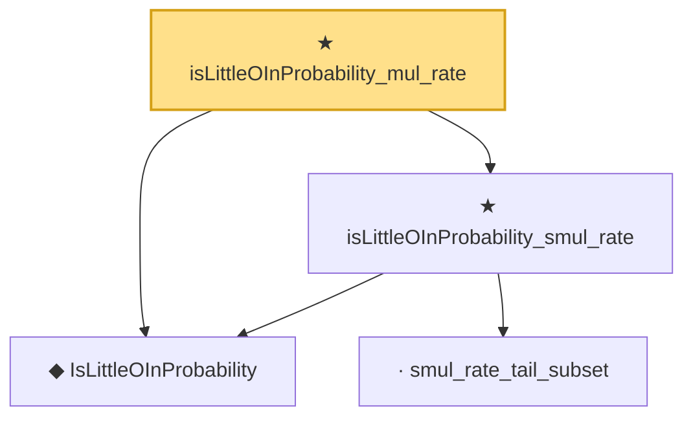

# Proof narrative — isLittleOInProbability_mul_rate

Root: **isLittleOInProbability_mul_rate** (theorem) `Statlib/StatFoundation/Convergence/AnalysisTools/StochasticOrder/AlgebraDeterministicScale.lean:71` · topic `StatFoundation`
Closure: 4 declarations across 2 files. Generated from `proof_graph.json` — no files were moved.

Reading order (foundations first, headline last):

  ◆ `IsLittleOInProbability` — def · `Statlib/StatFoundation/Vocabulary/StochasticOrder.lean:58`  _(also used by 49: isLittleOInProbability_add, isLittleOInProbability_finset_sum, isLittleOInProbability_const_smul, …)_
    · `smul_rate_tail_subset` — private lemma · `Statlib/StatFoundation/Convergence/AnalysisTools/StochasticOrder/AlgebraDeterministicScale.lean:18`  _(also used by 1: isBigOInProbability_smul_rate)_
  ★ `isLittleOInProbability_smul_rate` — theorem · `Statlib/StatFoundation/Convergence/AnalysisTools/StochasticOrder/AlgebraDeterministicScale.lean:47`
★ `isLittleOInProbability_mul_rate` — theorem · `Statlib/StatFoundation/Convergence/AnalysisTools/StochasticOrder/AlgebraDeterministicScale.lean:71` **← headline**

## Dependency diagram

