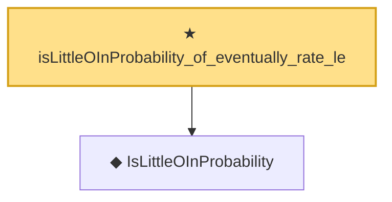

# Proof narrative — isLittleOInProbability_of_eventually_rate_le

Root: **isLittleOInProbability_of_eventually_rate_le** (theorem) `Statlib/StatFoundation/Convergence/AnalysisTools/StochasticOrder/RateBounds.lean:30` · topic `StatFoundation`
Closure: 2 declarations across 2 files. Generated from `proof_graph.json` — no files were moved.

Reading order (foundations first, headline last):

  ◆ `IsLittleOInProbability` — def · `Statlib/StatFoundation/Vocabulary/StochasticOrder.lean:58`  _(also used by 50: isLittleOInProbability_add, isLittleOInProbability_smul_rate, isLittleOInProbability_mul_rate, …)_
★ `isLittleOInProbability_of_eventually_rate_le` — theorem · `Statlib/StatFoundation/Convergence/AnalysisTools/StochasticOrder/RateBounds.lean:30` **← headline**

## Dependency diagram

