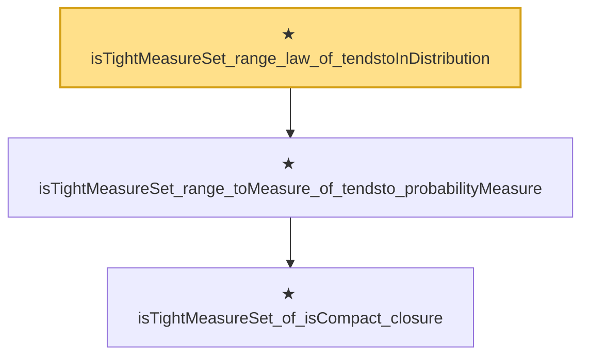

# Proof narrative — isTightMeasureSet_range_law_of_tendstoInDistribution

Root: **isTightMeasureSet_range_law_of_tendstoInDistribution** (theorem) `Statlib/StatFoundation/Convergence/AnalysisTools/Tightness.lean:521` · topic `StatFoundation`
Closure: 3 declarations across 1 files. Generated from `proof_graph.json` — no files were moved.

Reading order (foundations first, headline last):

    ★ `isTightMeasureSet_of_isCompact_closure` — theorem · `Statlib/StatFoundation/Convergence/AnalysisTools/Tightness.lean:122`
  ★ `isTightMeasureSet_range_toMeasure_of_tendsto_probabilityMeasure` — theorem · `Statlib/StatFoundation/Convergence/AnalysisTools/Tightness.lean:502`
★ `isTightMeasureSet_range_law_of_tendstoInDistribution` — theorem · `Statlib/StatFoundation/Convergence/AnalysisTools/Tightness.lean:521` **← headline**

## Dependency diagram

