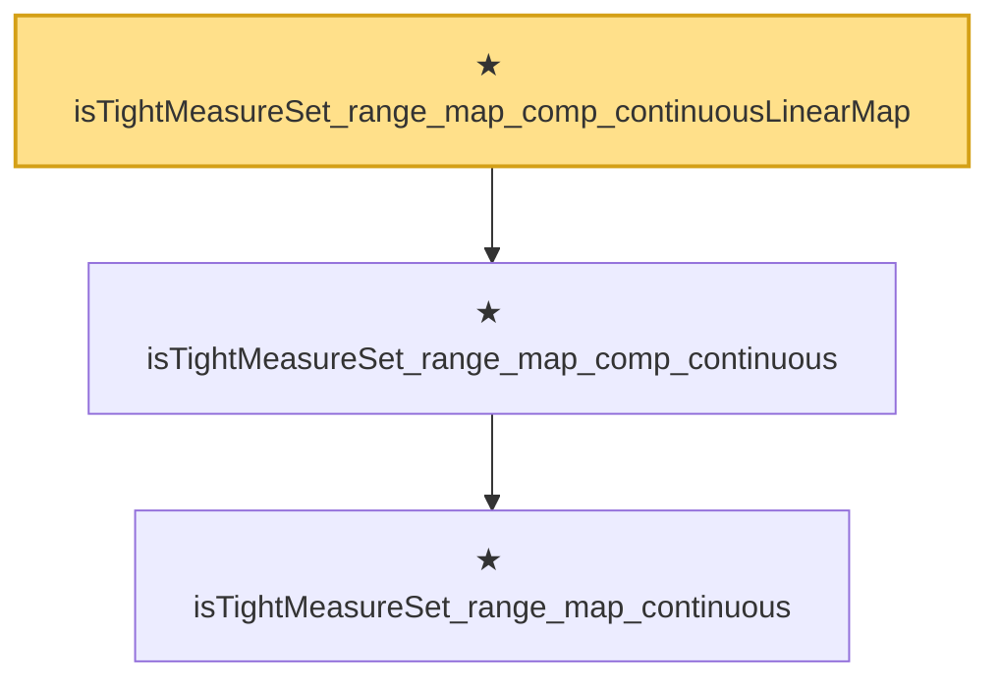

# Proof narrative — isTightMeasureSet_range_map_comp_continuousLinearMap

Root: **isTightMeasureSet_range_map_comp_continuousLinearMap** (theorem) `Statlib/StatFoundation/Convergence/AnalysisTools/Tightness.lean:227` · topic `StatFoundation`
Closure: 3 declarations across 1 files. Generated from `proof_graph.json` — no files were moved.

Reading order (foundations first, headline last):

    ★ `isTightMeasureSet_range_map_continuous` — theorem · `Statlib/StatFoundation/Convergence/AnalysisTools/Tightness.lean:177`  _(also used by 2: isTightMeasureSet_range_map_continuousLinearMap, isTightMeasureSet_range_map_norm)_
  ★ `isTightMeasureSet_range_map_comp_continuous` — theorem · `Statlib/StatFoundation/Convergence/AnalysisTools/Tightness.lean:211`  _(also used by 1: isTightMeasureSet_range_map_comp_norm)_
★ `isTightMeasureSet_range_map_comp_continuousLinearMap` — theorem · `Statlib/StatFoundation/Convergence/AnalysisTools/Tightness.lean:227` **← headline**

## Dependency diagram

