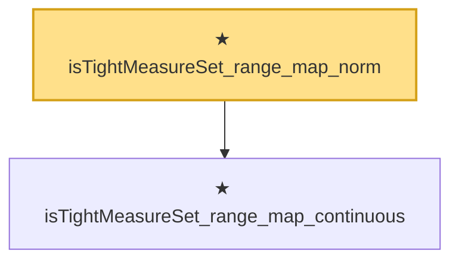

# Proof narrative — isTightMeasureSet_range_map_norm

Root: **isTightMeasureSet_range_map_norm** (theorem) `Statlib/StatFoundation/Convergence/AnalysisTools/Tightness.lean:203` · topic `StatFoundation`
Closure: 2 declarations across 1 files. Generated from `proof_graph.json` — no files were moved.

Reading order (foundations first, headline last):

  ★ `isTightMeasureSet_range_map_continuous` — theorem · `Statlib/StatFoundation/Convergence/AnalysisTools/Tightness.lean:177`  _(also used by 2: isTightMeasureSet_range_map_continuousLinearMap, isTightMeasureSet_range_map_comp_continuous)_
★ `isTightMeasureSet_range_map_norm` — theorem · `Statlib/StatFoundation/Convergence/AnalysisTools/Tightness.lean:203` **← headline**

## Dependency diagram

