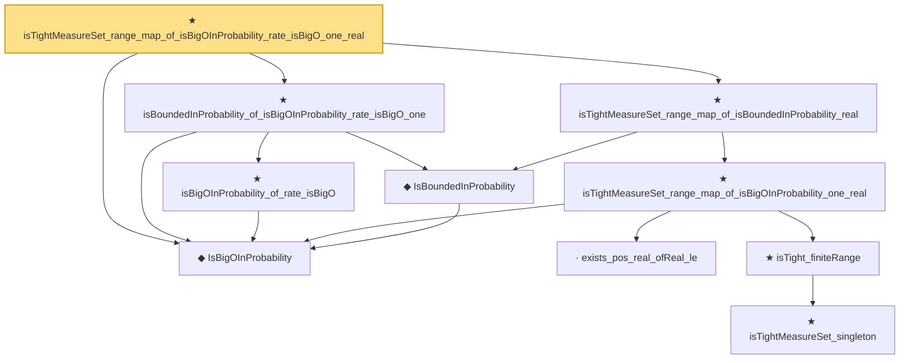

# Proof narrative — isTightMeasureSet_range_map_of_isBigOInProbability_rate_isBigO_one_real

Root: **isTightMeasureSet_range_map_of_isBigOInProbability_rate_isBigO_one_real** (theorem) `Statlib/StatFoundation/Convergence/AnalysisTools/Tightness.lean:429` · topic `StatFoundation`
Closure: 10 declarations across 4 files. Generated from `proof_graph.json` — no files were moved.

Reading order (foundations first, headline last):

  ◆ `IsBigOInProbability` — def · `Statlib/StatFoundation/Vocabulary/StochasticOrder.lean:48`  _(also used by 51: isBigOInProbability_add, isBigOInProbability_smul_rate, isBigOInProbability_mul_rate, …)_
    ◆ `IsBoundedInProbability` — abbrev · `Statlib/StatFoundation/Vocabulary/StochasticOrder.lean:64`  _(also used by 6: isBoundedInProbability_iff_isBigOInProbability_one, isBoundedInProbability_of_isBigOInProbability_tendsto_zero, isBoundedInProbability_of_isLittleOInProbability_rate_isBigO_one, …)_
      · `exists_pos_real_ofReal_le` — lemma · `Statlib/StatFoundation/Vocabulary/StochasticOrder.lean:25`  _(also used by 1: isTightMeasureSet_range_map_of_isBigOInProbability_one_proper)_
        ★ `isTightMeasureSet_singleton` — theorem · `Statlib/StatFoundation/Convergence/AnalysisTools/Tightness.lean:113`  _(also used by 1: isTightMeasureSet_finiteRange)_
      ★ `isTight_finiteRange` — theorem · `Statlib/StatFoundation/Convergence/AnalysisTools/Tightness.lean:18`  _(also used by 1: isTight_of_charFun_tendsto)_
    ★ `isTightMeasureSet_range_map_of_isBigOInProbability_one_real` — theorem · `Statlib/StatFoundation/Convergence/AnalysisTools/Tightness.lean:255`
  ★ `isTightMeasureSet_range_map_of_isBoundedInProbability_real` — theorem · `Statlib/StatFoundation/Convergence/AnalysisTools/Tightness.lean:304`  _(also used by 2: isTightMeasureSet_range_map_of_isBigOInProbability_tendsto_zero_real, isTightMeasureSet_range_map_of_isLittleOInProbability_rate_isBigO_one_real)_
    ★ `isBigOInProbability_of_rate_isBigO` — theorem · `Statlib/StatFoundation/Convergence/AnalysisTools/StochasticOrder/RateBig.lean:11`  _(also used by 1: isBigOInProbability_of_eventually_rate_le)_
  ★ `isBoundedInProbability_of_isBigOInProbability_rate_isBigO_one` — theorem · `Statlib/StatFoundation/Convergence/AnalysisTools/StochasticOrder/ConvergenceBridges.lean:514`  _(also used by 2: isTightMeasureSet_range_map_of_isBigOInProbability_rate_isBigO_one_proper, isTightMeasureSet_range_map_of_isBigOInProbability_rate_isBigO_one_finiteDimensional)_
★ `isTightMeasureSet_range_map_of_isBigOInProbability_rate_isBigO_one_real` — theorem · `Statlib/StatFoundation/Convergence/AnalysisTools/Tightness.lean:429` **← headline**

## Dependency diagram

