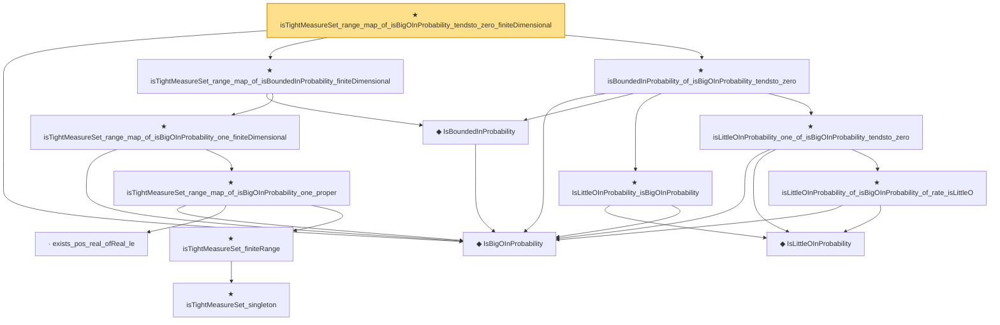

# Proof narrative — isTightMeasureSet_range_map_of_isBigOInProbability_tendsto_zero_finiteDimensional

Root: **isTightMeasureSet_range_map_of_isBigOInProbability_tendsto_zero_finiteDimensional** (theorem) `Statlib/StatFoundation/Convergence/AnalysisTools/Tightness.lean:416` · topic `StatFoundation`
Closure: 14 declarations across 5 files. Generated from `proof_graph.json` — no files were moved.

Reading order (foundations first, headline last):

  ◆ `IsBigOInProbability` — def · `Statlib/StatFoundation/Vocabulary/StochasticOrder.lean:48`  _(also used by 48: isBigOInProbability_add, isBigOInProbability_smul_rate, isBigOInProbability_mul_rate, …)_
    ◆ `IsBoundedInProbability` — abbrev · `Statlib/StatFoundation/Vocabulary/StochasticOrder.lean:64`  _(also used by 6: isBoundedInProbability_iff_isBigOInProbability_one, isBoundedInProbability_of_isBigOInProbability_rate_isBigO_one, isBoundedInProbability_of_isLittleOInProbability_rate_isBigO_one, …)_
        · `exists_pos_real_ofReal_le` — lemma · `Statlib/StatFoundation/Vocabulary/StochasticOrder.lean:25`  _(also used by 1: isTightMeasureSet_range_map_of_isBigOInProbability_one_real)_
          ★ `isTightMeasureSet_singleton` — theorem · `Statlib/StatFoundation/Convergence/AnalysisTools/Tightness.lean:113`  _(also used by 1: isTight_finiteRange)_
        ★ `isTightMeasureSet_finiteRange` — theorem · `Statlib/StatFoundation/Convergence/AnalysisTools/Tightness.lean:40`
      ★ `isTightMeasureSet_range_map_of_isBigOInProbability_one_proper` — theorem · `Statlib/StatFoundation/Convergence/AnalysisTools/Tightness.lean:313`  _(also used by 1: isTightMeasureSet_range_map_of_isBoundedInProbability_proper)_
    ★ `isTightMeasureSet_range_map_of_isBigOInProbability_one_finiteDimensional` — theorem · `Statlib/StatFoundation/Convergence/AnalysisTools/Tightness.lean:371`
  ★ `isTightMeasureSet_range_map_of_isBoundedInProbability_finiteDimensional` — theorem · `Statlib/StatFoundation/Convergence/AnalysisTools/Tightness.lean:382`  _(also used by 2: isTightMeasureSet_range_map_of_isBigOInProbability_rate_isBigO_one_finiteDimensional, isTightMeasureSet_range_map_of_isLittleOInProbability_rate_isBigO_one_finiteDimensional)_
      ◆ `IsLittleOInProbability` — def · `Statlib/StatFoundation/Vocabulary/StochasticOrder.lean:58`  _(also used by 48: isLittleOInProbability_add, isLittleOInProbability_smul_rate, isLittleOInProbability_mul_rate, …)_
    ★ `IsLittleOInProbability_isBigOInProbability` — theorem · `Statlib/StatFoundation/Convergence/AnalysisTools/StochasticOrder/Basic.lean:179`  _(also used by 1: isBoundedInProbability_of_isLittleOInProbability_rate_isBigO_one)_
      ★ `isLittleOInProbability_of_isBigOInProbability_of_rate_isLittleO` — theorem · `Statlib/StatFoundation/Convergence/AnalysisTools/StochasticOrder/RateRefinement.lean:15`
    ★ `isLittleOInProbability_one_of_isBigOInProbability_tendsto_zero` — theorem · `Statlib/StatFoundation/Convergence/AnalysisTools/StochasticOrder/RateRefinement.lean:62`  _(also used by 3: hasCoordinatewiseIsLittleOInProbability_debiasedLasso_scaledBiasRemainder_of_l1Error_and_rowApproxError_real, tendstoInMeasure_zero_of_isBigOInProbability_tendsto_zero, inProbabilityConvergence_zero_of_isBigOInProbability_tendsto_zero)_
  ★ `isBoundedInProbability_of_isBigOInProbability_tendsto_zero` — theorem · `Statlib/StatFoundation/Convergence/AnalysisTools/StochasticOrder/ConvergenceBridges.lean:426`  _(also used by 2: isTightMeasureSet_range_map_of_isBigOInProbability_tendsto_zero_real, isTightMeasureSet_range_map_of_isBigOInProbability_tendsto_zero_proper)_
★ `isTightMeasureSet_range_map_of_isBigOInProbability_tendsto_zero_finiteDimensional` — theorem · `Statlib/StatFoundation/Convergence/AnalysisTools/Tightness.lean:416` **← headline**

## Dependency diagram

