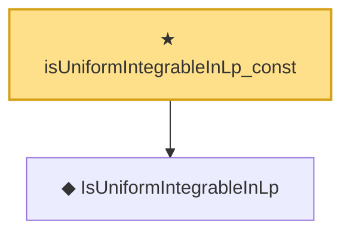

# Proof narrative — isUniformIntegrableInLp_const

Root: **isUniformIntegrableInLp_const** (theorem) `Statlib/StatFoundation/Convergence/AnalysisTools/UniformIntegrability.lean:53` · topic `StatFoundation`
Closure: 2 declarations across 2 files. Generated from `proof_graph.json` — no files were moved.

Reading order (foundations first, headline last):

  ◆ `IsUniformIntegrableInLp` — abbrev · `Statlib/StatFoundation/Vocabulary/UniformIntegrability.lean:53`  _(also used by 39: memLp_two_of_inProbabilityConvergence_of_isUniformIntegrableInLp_two, inLpConvergence_two_of_inProbabilityConvergence_of_isUniformIntegrableInLp_two, tendsto_integral_of_inProbabilityConvergence_of_isUniformIntegrableInLp_two, …)_
★ `isUniformIntegrableInLp_const` — theorem · `Statlib/StatFoundation/Convergence/AnalysisTools/UniformIntegrability.lean:53` **← headline**

## Dependency diagram

