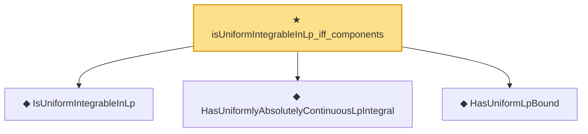

# Proof narrative — isUniformIntegrableInLp_iff_components

Root: **isUniformIntegrableInLp_iff_components** (theorem) `Statlib/StatFoundation/Vocabulary/UniformIntegrability.lean:65` · topic `StatFoundation`
Closure: 4 declarations across 1 files. Generated from `proof_graph.json` — no files were moved.

Reading order (foundations first, headline last):

  ◆ `IsUniformIntegrableInLp` — abbrev · `Statlib/StatFoundation/Vocabulary/UniformIntegrability.lean:53`  _(also used by 39: memLp_two_of_inProbabilityConvergence_of_isUniformIntegrableInLp_two, inLpConvergence_two_of_inProbabilityConvergence_of_isUniformIntegrableInLp_two, tendsto_integral_of_inProbabilityConvergence_of_isUniformIntegrableInLp_two, …)_
  ◆ `HasUniformlyAbsolutelyContinuousLpIntegral` — abbrev · `Statlib/StatFoundation/Vocabulary/UniformIntegrability.lean:25`  _(also used by 6: tendsto_eLpNorm_zero_of_tendstoInMeasure_of_hasUniformlyAbsolutelyContinuousLpIntegral, inLpConvergence_of_tendstoInMeasure_of_hasUniformlyAbsolutelyContinuousLpIntegral, tendstoInMeasure_and_hasUniformlyAbsolutelyContinuousLpIntegral_iff_inLpConvergence, …)_
  ◆ `HasUniformLpBound` — abbrev · `Statlib/StatFoundation/Vocabulary/UniformIntegrability.lean:36`
★ `isUniformIntegrableInLp_iff_components` — theorem · `Statlib/StatFoundation/Vocabulary/UniformIntegrability.lean:65` **← headline**

## Dependency diagram

