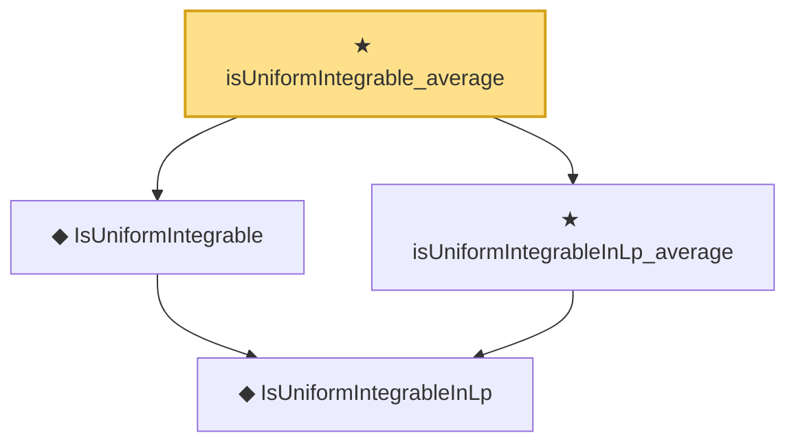

# Proof narrative — isUniformIntegrable_average

Root: **isUniformIntegrable_average** (theorem) `Statlib/StatFoundation/Convergence/AnalysisTools/UniformIntegrability.lean:274` · topic `StatFoundation`
Closure: 4 declarations across 2 files. Generated from `proof_graph.json` — no files were moved.

Reading order (foundations first, headline last):

    ◆ `IsUniformIntegrableInLp` — abbrev · `Statlib/StatFoundation/Vocabulary/UniformIntegrability.lean:53`  _(also used by 38: memLp_two_of_inProbabilityConvergence_of_isUniformIntegrableInLp_two, inLpConvergence_two_of_inProbabilityConvergence_of_isUniformIntegrableInLp_two, tendsto_integral_of_inProbabilityConvergence_of_isUniformIntegrableInLp_two, …)_
  ◆ `IsUniformIntegrable` — abbrev · `Statlib/StatFoundation/Vocabulary/UniformIntegrability.lean:59`  _(also used by 13: tendsto_integral_of_inProbabilityConvergence_of_isUniformIntegrable, tendsto_norm_integral_sub_zero_of_inProbabilityConvergence_of_isUniformIntegrable, tendsto_integral_continuousLinearMap_of_inProbabilityConvergence_of_isUniformIntegrable, …)_
  ★ `isUniformIntegrableInLp_average` — theorem · `Statlib/StatFoundation/Convergence/AnalysisTools/UniformIntegrability.lean:265`
★ `isUniformIntegrable_average` — theorem · `Statlib/StatFoundation/Convergence/AnalysisTools/UniformIntegrability.lean:274` **← headline**

## Dependency diagram

