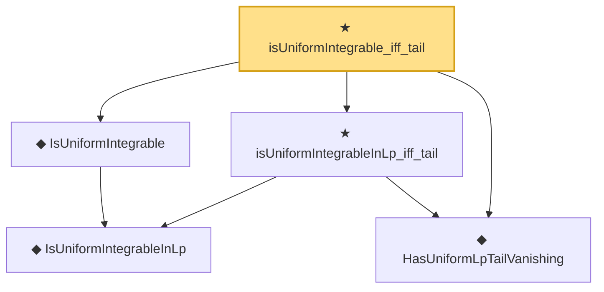

# Proof narrative — isUniformIntegrable_iff_tail

Root: **isUniformIntegrable_iff_tail** (theorem) `Statlib/StatFoundation/Vocabulary/UniformIntegrability.lean:85` · topic `StatFoundation`
Closure: 5 declarations across 1 files. Generated from `proof_graph.json` — no files were moved.

Reading order (foundations first, headline last):

    ◆ `IsUniformIntegrableInLp` — abbrev · `Statlib/StatFoundation/Vocabulary/UniformIntegrability.lean:53`  _(also used by 38: memLp_two_of_inProbabilityConvergence_of_isUniformIntegrableInLp_two, inLpConvergence_two_of_inProbabilityConvergence_of_isUniformIntegrableInLp_two, tendsto_integral_of_inProbabilityConvergence_of_isUniformIntegrableInLp_two, …)_
  ◆ `IsUniformIntegrable` — abbrev · `Statlib/StatFoundation/Vocabulary/UniformIntegrability.lean:59`  _(also used by 13: tendsto_integral_of_inProbabilityConvergence_of_isUniformIntegrable, tendsto_norm_integral_sub_zero_of_inProbabilityConvergence_of_isUniformIntegrable, tendsto_integral_continuousLinearMap_of_inProbabilityConvergence_of_isUniformIntegrable, …)_
  ◆ `HasUniformLpTailVanishing` — abbrev · `Statlib/StatFoundation/Vocabulary/UniformIntegrability.lean:45`
  ★ `isUniformIntegrableInLp_iff_tail` — theorem · `Statlib/StatFoundation/Vocabulary/UniformIntegrability.lean:75`
★ `isUniformIntegrable_iff_tail` — theorem · `Statlib/StatFoundation/Vocabulary/UniformIntegrability.lean:85` **← headline**

## Dependency diagram

