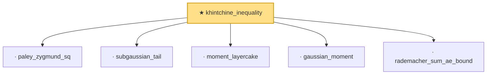

# Proof narrative — khintchine_inequality

Root: **khintchine_inequality** (theorem) `Statlib/StatFoundation/Concentration/MomentType/khintchine_inequality.lean:246` · topic `StatFoundation`
Closure: 6 declarations across 1 files. Generated from `proof_graph.json` — no files were moved.

Reading order (foundations first, headline last):

  · `paley_zygmund_sq` — private lemma · `Statlib/StatFoundation/Concentration/MomentType/khintchine_inequality.lean:145`
  · `subgaussian_tail` — private lemma · `Statlib/StatFoundation/Concentration/MomentType/khintchine_inequality.lean:11`
  · `moment_layercake` — private lemma · `Statlib/StatFoundation/Concentration/MomentType/khintchine_inequality.lean:67`
  · `gaussian_moment` — private lemma · `Statlib/StatFoundation/Concentration/MomentType/khintchine_inequality.lean:97`
  · `rademacher_sum_ae_bound` — private lemma · `Statlib/StatFoundation/Concentration/MomentType/khintchine_inequality.lean:210`
★ `khintchine_inequality` — theorem · `Statlib/StatFoundation/Concentration/MomentType/khintchine_inequality.lean:246` **← headline**

## Dependency diagram

