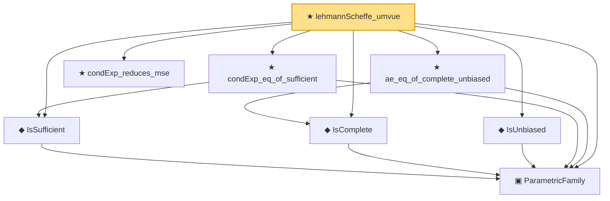

# Proof narrative — lehmannScheffe_umvue

Root: **lehmannScheffe_umvue** (theorem) `Statlib/StatFoundation/Statistics/Sufficiency/LehmannScheffe/UMVUE.lean:28` · topic `StatFoundation`
Closure: 8 declarations across 5 files. Generated from `proof_graph.json` — no files were moved.

Reading order (foundations first, headline last):

  ▣ `ParametricFamily` — structure · `Statlib/StatFoundation/Statistics/Sufficiency/Basic.lean:49`
  ◆ `IsSufficient` — def · `Statlib/StatFoundation/Statistics/Sufficiency/Basic.lean:63`
  ◆ `IsComplete` — def · `Statlib/StatFoundation/Statistics/Sufficiency/Basic.lean:56`
  ◆ `IsUnbiased` — def · `Statlib/StatFoundation/Statistics/Sufficiency/Basic.lean:73`
  ★ `condExp_eq_of_sufficient` — theorem · `Statlib/StatFoundation/Statistics/Sufficiency/LehmannScheffe/CondExp.lean:17`
  ★ `condExp_reduces_mse` — theorem · `Statlib/StatFoundation/Statistics/Sufficiency/LehmannScheffe/MSE.lean:19`
  ★ `ae_eq_of_complete_unbiased` — theorem · `Statlib/StatFoundation/Statistics/Sufficiency/LehmannScheffe/CompleteUnique.lean:15`
★ `lehmannScheffe_umvue` — theorem · `Statlib/StatFoundation/Statistics/Sufficiency/LehmannScheffe/UMVUE.lean:28` **← headline**

## Dependency diagram

