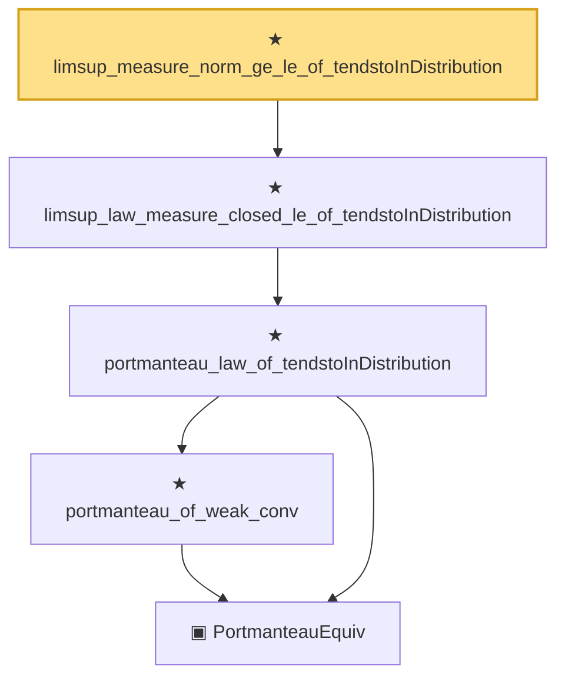

# Proof narrative — limsup_measure_norm_ge_le_of_tendstoInDistribution

Root: **limsup_measure_norm_ge_le_of_tendstoInDistribution** (theorem) `Statlib/StatFoundation/Convergence/AnalysisTools/ConvergenceModes.lean:1303` · topic `StatFoundation`
Closure: 5 declarations across 1 files. Generated from `proof_graph.json` — no files were moved.

Reading order (foundations first, headline last):

      ▣ `PortmanteauEquiv` — structure · `Statlib/StatFoundation/Convergence/AnalysisTools/ConvergenceModes.lean:1201`
      ★ `portmanteau_of_weak_conv` — theorem · `Statlib/StatFoundation/Convergence/AnalysisTools/ConvergenceModes.lean:1231`
    ★ `portmanteau_law_of_tendstoInDistribution` — theorem · `Statlib/StatFoundation/Convergence/AnalysisTools/ConvergenceModes.lean:1246`  _(also used by 2: le_liminf_law_measure_open_of_tendstoInDistribution, tendsto_law_measure_of_null_frontier_of_tendstoInDistribution)_
  ★ `limsup_law_measure_closed_le_of_tendstoInDistribution` — theorem · `Statlib/StatFoundation/Convergence/AnalysisTools/ConvergenceModes.lean:1261`  _(also used by 2: limsup_measure_real_le_le_of_tendstoInDistribution, limsup_measure_real_ge_le_of_tendstoInDistribution)_
★ `limsup_measure_norm_ge_le_of_tendstoInDistribution` — theorem · `Statlib/StatFoundation/Convergence/AnalysisTools/ConvergenceModes.lean:1303` **← headline**

## Dependency diagram

