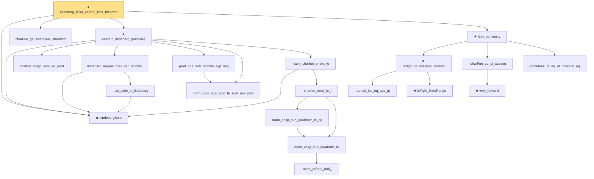

# Proof narrative — lindeberg_feller_central_limit_theorem

Root: **lindeberg_feller_central_limit_theorem** (theorem) `Statlib/StatFoundation/Convergence/CentralLimitTheorem/LindebergFeller.lean:676` · topic `StatFoundation`
Closure: 21 declarations across 4 files. Generated from `proof_graph.json` — no files were moved.

Reading order (foundations first, headline last):

  ◆ `LindebergSum` — def · `Statlib/StatFoundation/Convergence/CentralLimitTheorem/LindebergFeller.lean:25`
  · `charFun_gaussianReal_standard` — lemma · `Statlib/StatFoundation/Convergence/AnalysisTools/CharacteristicFunction.lean:272`  _(also used by 1: charfun_normalized_sum_bound)_
    · `charfun_indep_sum_eq_prod` — lemma · `Statlib/StatFoundation/Convergence/CentralLimitTheorem/LindebergFeller.lean:34`
      · `var_ratio_le_lindeberg` — lemma · `Statlib/StatFoundation/Convergence/CentralLimitTheorem/LindebergFeller.lean:274`
    · `lindeberg_implies_max_var_tendsto` — lemma · `Statlib/StatFoundation/Convergence/CentralLimitTheorem/LindebergFeller.lean:327`
    · `norm_prod_sub_prod_le_sum_mul_pow` — lemma · `Statlib/StatFoundation/Convergence/AnalysisTools/CharacteristicFunction.lean:227`
    · `prod_one_sub_tendsto_exp_neg` — lemma · `Statlib/StatFoundation/Convergence/CentralLimitTheorem/LindebergFeller.lean:380`
            · `norm_ofReal_mul_I` — lemma · `Statlib/StatFoundation/Convergence/AnalysisTools/CharacteristicFunction.lean:16`  _(also used by 1: norm_cexp_sub_quadratic_le_third)_
        · `norm_cexp_sub_quadratic_le` — lemma · `Statlib/StatFoundation/Convergence/AnalysisTools/CharacteristicFunction.lean:22`  _(also used by 1: charfun_taylor_third_moment)_
        · `norm_cexp_sub_quadratic_le_sq` — lemma · `Statlib/StatFoundation/Convergence/CentralLimitTheorem/LindebergFeller.lean:79`
      · `charfun_error_le_j` — lemma · `Statlib/StatFoundation/Convergence/CentralLimitTheorem/LindebergFeller.lean:110`
    · `sum_charfun_errors_le` — lemma · `Statlib/StatFoundation/Convergence/CentralLimitTheorem/LindebergFeller.lean:243`
  ★ `charfun_lindeberg_pointwise` — theorem · `Statlib/StatFoundation/Convergence/CentralLimitTheorem/LindebergFeller.lean:476`
      · `compl_Icc_eq_abs_gt` — lemma · `Statlib/StatFoundation/Convergence/AnalysisTools/LevyContinuity.lean:15`
      ★ `isTight_finiteRange` — theorem · `Statlib/StatFoundation/Convergence/AnalysisTools/Tightness.lean:14`
    ★ `isTight_of_charFun_tendsto` — theorem · `Statlib/StatFoundation/Convergence/AnalysisTools/LevyContinuity.lean:44`  _(also used by 1: isTight_of_charFun_tendsto_inner)_
      ★ `levy_forward` — theorem · `Statlib/StatFoundation/Convergence/AnalysisTools/LevyContinuity.lean:31`  _(also used by 1: cramer_wold_reverse)_
    · `charFun_eq_of_subseq` — lemma · `Statlib/StatFoundation/Convergence/AnalysisTools/LevyContinuity.lean:168`
    · `probMeasure_eq_of_charFun_eq` — lemma · `Statlib/StatFoundation/Convergence/AnalysisTools/LevyContinuity.lean:180`
  ★ `levy_continuity` — theorem · `Statlib/StatFoundation/Convergence/AnalysisTools/LevyContinuity.lean:193`  _(also used by 1: iid_central_limit_theorem)_
★ `lindeberg_feller_central_limit_theorem` — theorem · `Statlib/StatFoundation/Convergence/CentralLimitTheorem/LindebergFeller.lean:676` **← headline**

## Dependency diagram

