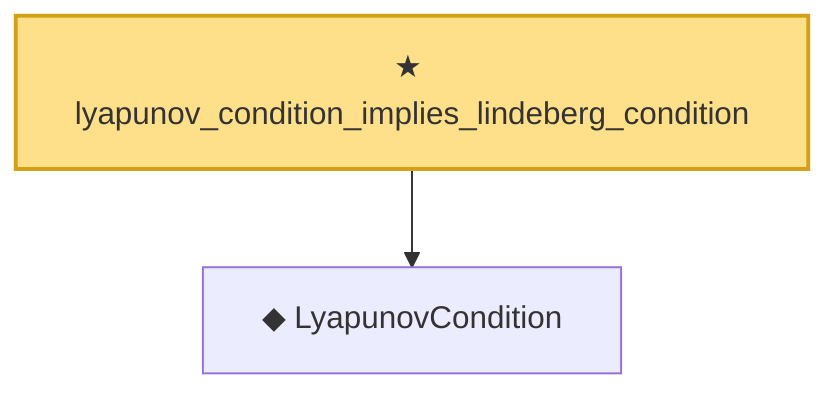

# Proof narrative — lyapunov_condition_implies_lindeberg_condition

Root: **lyapunov_condition_implies_lindeberg_condition** (theorem) `Statlib/StatFoundation/Convergence/CentralLimitTheorem/Lyapunov.lean:41` · topic `StatFoundation`
Closure: 2 declarations across 1 files. Generated from `proof_graph.json` — no files were moved.

Reading order (foundations first, headline last):

  ◆ `LyapunovCondition` — def · `Statlib/StatFoundation/Convergence/CentralLimitTheorem/Lyapunov.lean:24`
★ `lyapunov_condition_implies_lindeberg_condition` — theorem · `Statlib/StatFoundation/Convergence/CentralLimitTheorem/Lyapunov.lean:41` **← headline**

## Dependency diagram

