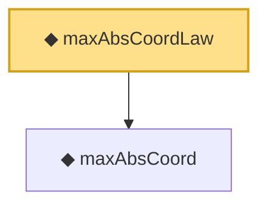

# Proof narrative — maxAbsCoordLaw

Root: **maxAbsCoordLaw** (noncomputable abbrev) `Statlib/StatFoundation/Vocabulary/MaxType.lean:49` · topic `StatFoundation`
Closure: 2 declarations across 1 files. Generated from `proof_graph.json` — no files were moved.

Reading order (foundations first, headline last):

  ◆ `maxAbsCoord` — noncomputable def · `Statlib/StatFoundation/Vocabulary/MaxType.lean:39`  _(also used by 5: maxAbsCoord_measurable, maxAbsCoord_lipschitz, tendstoInDistribution_maxAbsCoord_of_tendstoInDistribution, …)_
◆ `maxAbsCoordLaw` — noncomputable abbrev · `Statlib/StatFoundation/Vocabulary/MaxType.lean:49` **← headline**

## Dependency diagram

