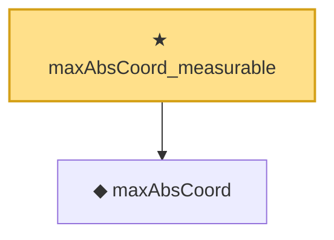

# Proof narrative — maxAbsCoord_measurable

Root: **maxAbsCoord_measurable** (theorem) `Statlib/StatFoundation/Convergence/CentralLimitTheorem/MaxType.lean:36` · topic `StatFoundation`
Closure: 2 declarations across 2 files. Generated from `proof_graph.json` — no files were moved.

Reading order (foundations first, headline last):

  ◆ `maxAbsCoord` — noncomputable def · `Statlib/StatFoundation/Vocabulary/MaxType.lean:39`  _(also used by 5: maxAbsCoord_lipschitz, tendstoInDistribution_maxAbsCoord_of_tendstoInDistribution, maxAbsCoord_standardizedPartialSum_tendsto, …)_
★ `maxAbsCoord_measurable` — theorem · `Statlib/StatFoundation/Convergence/CentralLimitTheorem/MaxType.lean:36` **← headline**

## Dependency diagram

