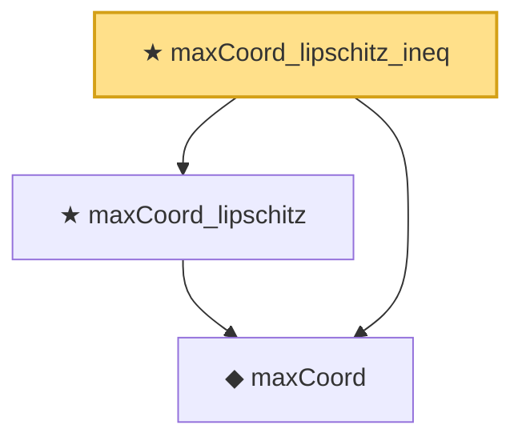

# Proof narrative — maxCoord_lipschitz_ineq

Root: **maxCoord_lipschitz_ineq** (theorem) `Statlib/StatFoundation/Convergence/CentralLimitTheorem/MaxType.lean:112` · topic `StatFoundation`
Closure: 3 declarations across 2 files. Generated from `proof_graph.json` — no files were moved.

Reading order (foundations first, headline last):

  ◆ `maxCoord` — noncomputable def · `Statlib/StatFoundation/Vocabulary/MaxType.lean:34`  _(also used by 11: smoothMax_bounds_max_log_card, maxCoord_measurable, tendstoInDistribution_maxCoord_of_tendstoInDistribution, …)_
  ★ `maxCoord_lipschitz` — theorem · `Statlib/StatFoundation/Convergence/CentralLimitTheorem/MaxType.lean:45`  _(also used by 1: tendstoInDistribution_maxCoord_of_tendstoInDistribution)_
★ `maxCoord_lipschitz_ineq` — theorem · `Statlib/StatFoundation/Convergence/CentralLimitTheorem/MaxType.lean:112` **← headline**

## Dependency diagram

