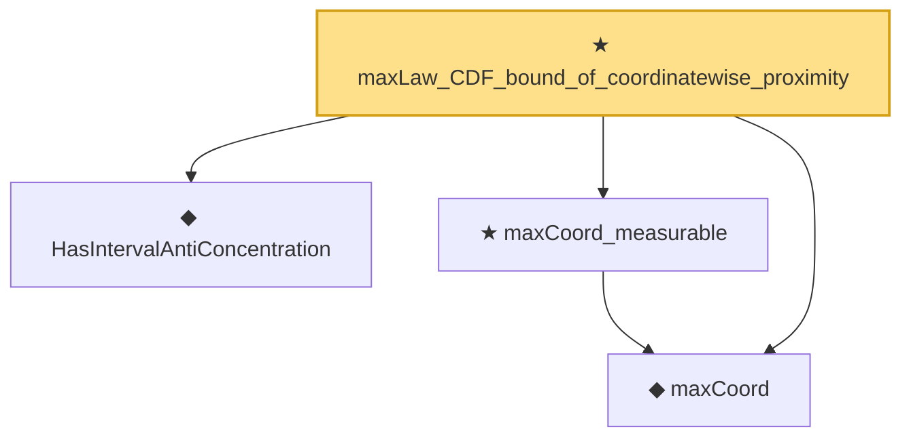

# Proof narrative — maxLaw_CDF_bound_of_coordinatewise_proximity

Root: **maxLaw_CDF_bound_of_coordinatewise_proximity** (theorem) `Statlib/StatFoundation/Convergence/Resampling/BootstrapInterface.lean:695` · topic `StatFoundation`
Closure: 4 declarations across 4 files. Generated from `proof_graph.json` — no files were moved.

Reading order (foundations first, headline last):

  ◆ `HasIntervalAntiConcentration` — def · `Statlib/StatFoundation/Vocabulary/Resampling.lean:36`  _(also used by 5: gaussianReal_interval_antiConcentration, finite_max_antiConcentration_union, kolmogorov_distance_transfer_to_quantile_coverage, …)_
  ◆ `maxCoord` — noncomputable def · `Statlib/StatFoundation/Vocabulary/MaxType.lean:34`  _(also used by 11: smoothMax_bounds_max_log_card, maxCoord_lipschitz, maxCoord_lipschitz_ineq, …)_
  ★ `maxCoord_measurable` — theorem · `Statlib/StatFoundation/Convergence/CentralLimitTheorem/MaxType.lean:29`  _(also used by 3: finite_max_antiConcentration_union, bootstrapMaxLaw_isProbabilityMeasure, bootstrap_coverage_from_distance_and_anticonc)_
★ `maxLaw_CDF_bound_of_coordinatewise_proximity` — theorem · `Statlib/StatFoundation/Convergence/Resampling/BootstrapInterface.lean:695` **← headline**

## Dependency diagram

