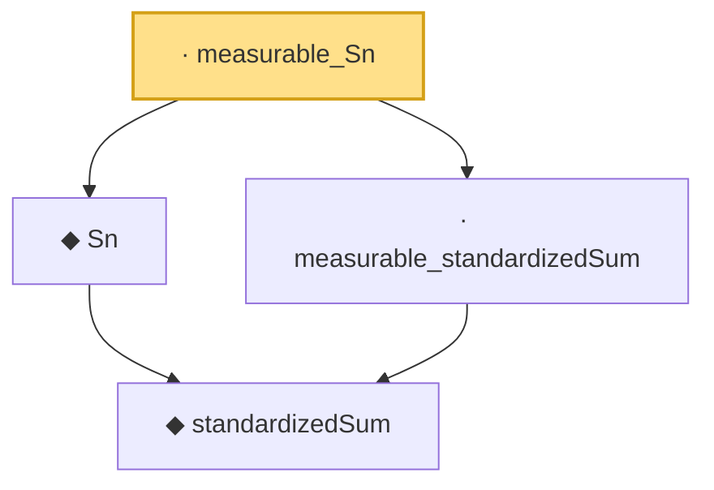

# Proof narrative — measurable_Sn

Root: **measurable_Sn** (lemma) `Statlib/StatFoundation/Convergence/CentralLimitTheorem/IID.lean:32` · topic `StatFoundation`
Closure: 4 declarations across 1 files. Generated from `proof_graph.json` — no files were moved.

Reading order (foundations first, headline last):

    ◆ `standardizedSum` — abbrev · `Statlib/StatFoundation/Convergence/CentralLimitTheorem/IID.lean:21`  _(also used by 2: iid_central_limit_theorem, central_limit_theorem)_
  ◆ `Sn` — abbrev · `Statlib/StatFoundation/Convergence/CentralLimitTheorem/IID.lean:29`
  · `measurable_standardizedSum` — lemma · `Statlib/StatFoundation/Convergence/CentralLimitTheorem/IID.lean:24`  _(also used by 2: iid_central_limit_theorem, central_limit_theorem)_
· `measurable_Sn` — lemma · `Statlib/StatFoundation/Convergence/CentralLimitTheorem/IID.lean:32` **← headline**

## Dependency diagram

