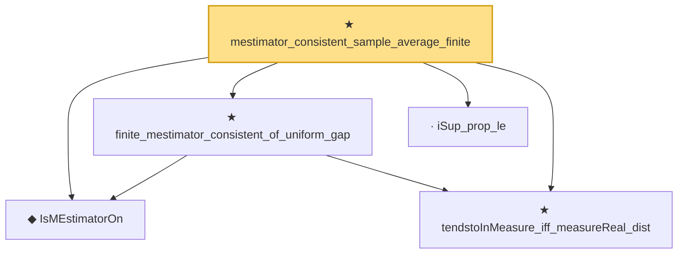

# Proof narrative — mestimator_consistent_sample_average_finite

Root: **mestimator_consistent_sample_average_finite** (theorem) `Statlib/StatFoundation/Statistics/Estimation/Consistency.lean:171` · topic `StatFoundation`
Closure: 5 declarations across 4 files. Generated from `proof_graph.json` — no files were moved.

Reading order (foundations first, headline last):

  ◆ `IsMEstimatorOn` — def · `Statlib/StatFoundation/Statistics/Estimation/Vocabulary.lean:102`  _(also used by 1: mestimator_asymptotic_normal_of_linearization)_
  ★ `tendstoInMeasure_iff_measureReal_dist` — theorem · `Statlib/StatFoundation/Convergence/AnalysisTools/ConvergenceModes.lean:617`  _(also used by 1: mle_asymptotic_normal_vec_cov)_
  ★ `finite_mestimator_consistent_of_uniform_gap` — theorem · `Statlib/StatFoundation/Statistics/Estimation/Consistency.lean:34`
  · `iSup_prop_le` — lemma · `Statlib/StatFoundation/Convergence/LawOfLargeNumbers/UniformStrongLaw.lean:143`  _(also used by 2: le_oscEnvelope, oscEnvelope_le_two_mul)_
★ `mestimator_consistent_sample_average_finite` — theorem · `Statlib/StatFoundation/Statistics/Estimation/Consistency.lean:171` **← headline**

## Dependency diagram

