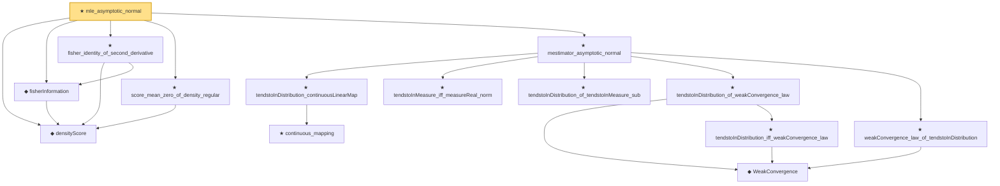

# Proof narrative — mle_asymptotic_normal

Root: **mle_asymptotic_normal** (theorem) `Statlib/StatFoundation/Statistics/Estimation/MLE.lean:164` · topic `StatFoundation`
Closure: 14 declarations across 6 files. Generated from `proof_graph.json` — no files were moved.

Reading order (foundations first, headline last):

  ◆ `densityScore` — noncomputable def · `Statlib/StatFoundation/Statistics/Estimation/Vocabulary.lean:64`  _(also used by 5: unbiased_derivative_eq_cov_score, cramer_rao_lower_bound, directionScoreInformationIdentity, …)_
  ◆ `fisherInformation` — noncomputable def · `Statlib/StatFoundation/Statistics/Estimation/Vocabulary.lean:72`  _(also used by 2: cramer_rao_lower_bound, directionScoreInformationIdentity)_
  ★ `fisher_identity_of_second_derivative` — theorem · `Statlib/StatFoundation/Statistics/Estimation/MLE.lean:39`  _(also used by 1: directionScoreInformationIdentity)_
  ★ `score_mean_zero_of_density_regular` — theorem · `Statlib/StatFoundation/Statistics/Estimation/CramerRao.lean:72`  _(also used by 2: cramer_rao_lower_bound, score_mean_zero_vec)_
      ★ `continuous_mapping` — theorem · `Statlib/StatFoundation/Convergence/AnalysisTools/MappingTheorems.lean:131`  _(also used by 5: tendstoInDistribution_lipschitz, tendstoInDistribution_norm, linear_combination_clt_to_finiteLinearCombination, …)_
    ★ `tendstoInDistribution_continuousLinearMap` — theorem · `Statlib/StatFoundation/Convergence/AnalysisTools/MappingTheorems.lean:153`  _(also used by 1: z_estimator_asymptotic_normal)_
    ★ `tendstoInMeasure_iff_measureReal_norm` — theorem · `Statlib/StatFoundation/Convergence/AnalysisTools/ConvergenceModes.lean:628`  _(also used by 1: mestimator_asymptotic_normal_of_linearization)_
    ★ `tendstoInDistribution_of_tendstoInMeasure_sub` — theorem · `Statlib/StatFoundation/Convergence/AnalysisTools/ConvergenceModes.lean:354`  _(also used by 12: tendstoInDistribution_debiasedLasso_scaledCenteredCoordinate_of_scoreCoordinate_and_l1_rowApprox_real, tendstoInDistribution_add_of_tendstoInMeasure_zero_left, tendstoInDistribution_add_of_tendstoInMeasure_zero_right, …)_
      ◆ `WeakConvergence` — def · `Statlib/StatFoundation/Convergence/AnalysisTools/ConvergenceModes.lean:163`  _(also used by 8: mle_asymptotic_normal, wald_statistic_asymptotic_chisq1, score_statistic_asymptotic_chisq1, …)_
      ★ `tendstoInDistribution_iff_weakConvergence_law` — theorem · `Statlib/StatFoundation/Convergence/AnalysisTools/ConvergenceModes.lean:175`
    ★ `tendstoInDistribution_of_weakConvergence_law` — theorem · `Statlib/StatFoundation/Convergence/AnalysisTools/ConvergenceModes.lean:204`  _(also used by 2: t_statistic_asymptotic_normal, tendstoInDistribution_of_probabilityMeasure_tendsto_and_gaussianReal_charFun)_
    ★ `weakConvergence_law_of_tendstoInDistribution` — theorem · `Statlib/StatFoundation/Convergence/AnalysisTools/ConvergenceModes.lean:192`  _(also used by 1: t_statistic_asymptotic_normal)_
  ★ `mestimator_asymptotic_normal` — theorem · `Statlib/StatFoundation/Statistics/Estimation/AsymptoticLinear.lean:1509`
★ `mle_asymptotic_normal` — theorem · `Statlib/StatFoundation/Statistics/Estimation/MLE.lean:164` **← headline**

## Dependency diagram

