# Proof narrative — mle_asymptotically_efficient

Root: **mle_asymptotically_efficient** (theorem) `Statlib/StatFoundation/Statistics/Estimation/MultiParameter.lean:1331` · topic `StatFoundation`
Closure: 39 declarations across 9 files. Generated from `proof_graph.json` — no files were moved.

Reading order (foundations first, headline last):

  ◆ `modelMeasureVec` — noncomputable def · `Statlib/StatFoundation/Statistics/Estimation/Vocabulary.lean:191`  _(also used by 1: unbiased_derivative_eq_cov_score_vec)_
  ◆ `densityScoreVec` — noncomputable def · `Statlib/StatFoundation/Statistics/Estimation/Vocabulary.lean:161`  _(also used by 3: fisherInformationMatrix_posSemidef, fisherInfoMatrix_quadForm, unbiased_derivative_eq_cov_score_vec)_
  ◆ `fisherInformationMatrix` — noncomputable def · `Statlib/StatFoundation/Statistics/Estimation/Vocabulary.lean:173`  _(also used by 2: fisherInformationMatrix_posSemidef, fisherInfoMatrix_quadForm)_
  ◆ `HasCoordinatewiseAEMeasurable` — abbrev · `Statlib/StatFoundation/Vocabulary/FiniteCoordinate.lean:33`  _(also used by 41: tendstoInDistribution_debiasedLasso_scaledCenteredFiniteCoordinate_of_linearScore_and_l1_rowApprox_real, tendstoInDistribution_studentizedDebiasedLasso_coordinate_of_linearScore_l1_rowApprox_and_se_real, tendstoInDistribution_debiasedLasso_scaledCenteredFiniteCoordinate_of_scoreVector_and_l1_rowApprox_real, …)_
  ◆ `scaledCenteredFiniteCoordinate` — abbrev · `Statlib/StatFoundation/Vocabulary/FiniteCoordinate.lean:76`  _(also used by 34: tendstoInDistribution_debiasedLasso_scaledCenteredFiniteCoordinate_of_linearScore_and_l1_rowApprox_real, tendstoInDistribution_studentizedDebiasedLasso_coordinate_of_linearScore_l1_rowApprox_and_se_real, tendstoInDistribution_debiasedLasso_scaledCenteredFiniteCoordinate_of_scoreVector_and_l1_rowApprox_real, …)_
  ◆ `HasCoordinatewiseAEMeasurableLimit` — abbrev · `Statlib/StatFoundation/Vocabulary/FiniteCoordinate.lean:38`  _(also used by 15: tendstoInDistribution_debiasedLasso_scaledCenteredFiniteCoordinate_of_linearScore_and_l1_rowApprox_real, tendstoInDistribution_studentizedDebiasedLasso_coordinate_of_linearScore_l1_rowApprox_and_se_real, tendstoInDistribution_debiasedLasso_scaledCenteredFiniteCoordinate_of_scoreVector_and_l1_rowApprox_real, …)_
  ◆ `finiteLinearCombination` — noncomputable abbrev · `Statlib/StatFoundation/Vocabulary/FiniteCoordinate.lean:29`  _(also used by 13: tendstoInDistribution_debiasedLasso_scaledCenteredFiniteCoordinate_of_linearScore_and_l1_rowApprox_real, hasFiniteLinearCombinationIsBigOInProbability_of_coordinatewise_real, hasFiniteLinearCombinationIsLittleOInProbability_of_coordinatewise_real, …)_
  ◆ `HasFiniteLinearCombinationTendstoInDistribution` — abbrev · `Statlib/StatFoundation/Vocabulary/FiniteCoordinate.lean:43`  _(also used by 18: tendstoInDistribution_debiasedLasso_scaledCenteredFiniteCoordinate_of_linearScore_and_l1_rowApprox_real, tendstoInDistribution_studentizedDebiasedLasso_coordinate_of_linearScore_l1_rowApprox_and_se_real, tendstoInDistribution_debiasedLasso_scaledCenteredFiniteCoordinate_of_scoreVector_and_l1_rowApprox_real, …)_
  ◆ `finiteCoordinateVector` — noncomputable abbrev · `Statlib/StatFoundation/Vocabulary/FiniteCoordinate.lean:25`  _(also used by 16: tendstoInDistribution_debiasedLasso_scaledCenteredFiniteCoordinate_of_linearScore_and_l1_rowApprox_real, tendstoInDistribution_debiasedLasso_scaledCenteredFiniteCoordinate_of_scoreVector_and_l1_rowApprox_real, tendstoInDistribution_studentizedDebiasedLasso_coordinate_of_scoreVector_l1_rowApprox_and_se_real, …)_
  ◆ `HasFiniteLinearCombinationTendstoInMeasureZero` — abbrev · `Statlib/StatFoundation/Vocabulary/FiniteCoordinate.lean:52`  _(also used by 2: tendstoInDistribution_debiasedLasso_scaledCenteredFiniteCoordinate_of_linearScore_and_l1_rowApprox_real, mestimator_asymptotic_normal_of_linearization)_
  ▣ `HasCenteredCovarianceMatrix` — structure · `Statlib/StatFoundation/Statistics/Estimation/Vocabulary.lean:252`
    ★ `fisherInformationMatrix_symm` — theorem · `Statlib/StatFoundation/Statistics/Estimation/MultiParameter.lean:72`  _(also used by 1: fisherInformationMatrix_posSemidef)_
    ★ `tendstoInMeasure_iff_measureReal_dist` — theorem · `Statlib/StatFoundation/Convergence/AnalysisTools/ConvergenceModes.lean:617`  _(also used by 2: finite_mestimator_consistent_of_uniform_gap, mestimator_consistent_sample_average_finite)_
            ★ `levy_forward` — theorem · `Statlib/StatFoundation/Convergence/AnalysisTools/LevyContinuity.lean:31`  _(also used by 1: charFun_eq_of_subseq)_
            · `charFun_map_innerSL` — lemma · `Statlib/StatFoundation/Convergence/AnalysisTools/CramerWold.lean:22`
            · `continuous_charFun` — lemma · `Statlib/StatFoundation/Convergence/AnalysisTools/CramerWold.lean:39`
            · `compl_Icc_eq_abs_gt` — lemma · `Statlib/StatFoundation/Convergence/AnalysisTools/LevyContinuity.lean:15`
            ★ `isTightMeasureSet_singleton` — theorem · `Statlib/StatFoundation/Convergence/AnalysisTools/Tightness.lean:113`  _(also used by 1: isTightMeasureSet_finiteRange)_
            ★ `isTight_finiteRange` — theorem · `Statlib/StatFoundation/Convergence/AnalysisTools/Tightness.lean:18`  _(also used by 1: isTightMeasureSet_range_map_of_isBigOInProbability_one_real)_
            ★ `isTight_of_charFun_tendsto` — theorem · `Statlib/StatFoundation/Convergence/AnalysisTools/LevyContinuity.lean:44`  _(also used by 1: levy_continuity)_
            · `isTight_of_charFun_tendsto_inner` — lemma · `Statlib/StatFoundation/Convergence/AnalysisTools/CramerWold.lean:131`
            ★ `levy_forward_inner` — theorem · `Statlib/StatFoundation/Convergence/AnalysisTools/CramerWold.lean:61`
            · `charFun_eq_of_subseq_inner` — lemma · `Statlib/StatFoundation/Convergence/AnalysisTools/CramerWold.lean:99`
            · `probMeasure_eq_of_charFun_eq_inner` — lemma · `Statlib/StatFoundation/Convergence/AnalysisTools/CramerWold.lean:114`
            ★ `cramer_wold_charFun` — theorem · `Statlib/StatFoundation/Convergence/AnalysisTools/CramerWold.lean:261`
            ★ `cramer_wold_reverse` — theorem · `Statlib/StatFoundation/Convergence/AnalysisTools/CramerWold.lean:297`  _(also used by 1: cramer_wold_iff)_
            ★ `tendstoInDistribution_of_forall_inner_real` — theorem · `Statlib/StatFoundation/Convergence/AnalysisTools/CramerWold.lean:348`  _(also used by 1: tendstoInDistribution_iff_forall_inner_real)_
          ★ `tendstoInDistribution_toLp_of_finiteLinearCombination_real` — theorem · `Statlib/StatFoundation/Convergence/AnalysisTools/CramerWold.lean:409`  _(also used by 4: tendstoInDistribution_toLp_iff_finiteLinearCombination_real, standardizedPartialSumVec_tendstoInDistribution, maxCoord_standardizedPartialSum_tendsto, …)_
          ★ `tendstoInMeasure_congr_left` — theorem · `Statlib/StatFoundation/Convergence/AnalysisTools/ConvergenceModes.lean:830`  _(also used by 7: inProbabilityConvergence_congr_left, tendstoInDistribution_add_of_isBigOInProbability_tendsto_zero_left, tendstoInDistribution_add_of_isBigOInProbability_tendsto_zero_right, …)_
          ★ `tendstoInDistribution_of_tendstoInMeasure_sub` — theorem · `Statlib/StatFoundation/Convergence/AnalysisTools/ConvergenceModes.lean:354`  _(also used by 12: tendstoInDistribution_debiasedLasso_scaledCenteredCoordinate_of_scoreCoordinate_and_l1_rowApprox_real, tendstoInDistribution_add_of_tendstoInMeasure_zero_left, tendstoInDistribution_add_of_tendstoInMeasure_zero_right, …)_
        ★ `tendstoInDistribution_toLp_of_finiteLinearCombination_remainder_tendstoInMeasure_real` — theorem · `Statlib/StatFoundation/Convergence/AnalysisTools/CramerWold.lean:454`  _(also used by 2: tendstoInDistribution_toLp_of_finiteLinearCombination_remainder_isBigOInProbability_real, tendstoInDistribution_toLp_of_finiteLinearCombination_remainder_isLittleOInProbability_real)_
      ★ `tendstoInDistribution_scaledCenteredFiniteCoordinate_of_remainder_tendstoInMeasure_real` — theorem · `Statlib/StatFoundation/Convergence/AnalysisTools/AsymptoticLinear.lean:56`  _(also used by 2: tendstoInDistribution_debiasedLasso_scaledCenteredFiniteCoordinate_of_linearScore_and_l1_rowApprox_real, mestimator_asymptotic_normal_of_linearization)_
    ★ `mle_asymptotic_normal_vec` — theorem · `Statlib/StatFoundation/Statistics/Estimation/MultiParameter.lean:321`
  ★ `mle_asymptotic_normal_vec_cov` — theorem · `Statlib/StatFoundation/Statistics/Estimation/MultiParameter.lean:1146`
      ◆ `densityScore` — noncomputable def · `Statlib/StatFoundation/Statistics/Estimation/Vocabulary.lean:64`  _(also used by 7: unbiased_derivative_eq_cov_score, cramer_rao_lower_bound, fisher_identity_of_second_derivative, …)_
      ★ `score_mean_zero_of_density_regular` — theorem · `Statlib/StatFoundation/Statistics/Estimation/CramerRao.lean:72`  _(also used by 2: cramer_rao_lower_bound, mle_asymptotic_normal)_
    ★ `score_mean_zero_vec` — theorem · `Statlib/StatFoundation/Statistics/Estimation/MultiParameter.lean:346`
  ★ `matrix_cram` — theorem · `Statlib/StatFoundation/Statistics/Estimation/MultiParameter.lean:629`
★ `mle_asymptotically_efficient` — theorem · `Statlib/StatFoundation/Statistics/Estimation/MultiParameter.lean:1331` **← headline**

## Dependency diagram

```mermaid
flowchart TD
  n0["◆ modelMeasureVec"]
  n1["◆ densityScoreVec"]
  n2["◆ fisherInformationMatrix"]
  n3["◆ HasCoordinatewiseAEMeasurable"]
  n4["◆ scaledCenteredFiniteCoordinate"]
  n5["◆ HasCoordinatewiseAEMeasurableLimit"]
  n6["◆ finiteLinearCombination"]
  n7["◆ HasFiniteLinearCombinationTendstoInDistribution"]
  n8["◆ finiteCoordinateVector"]
  n9["◆ HasFiniteLinearCombinationTendstoInMeasureZero"]
  n10["▣ HasCenteredCovarianceMatrix"]
  n11["★ fisherInformationMatrix_symm"]
  n12["★ tendstoInMeasure_iff_measureReal_dist"]
  n13["★ levy_forward"]
  n14["· charFun_map_innerSL"]
  n15["· continuous_charFun"]
  n16["· compl_Icc_eq_abs_gt"]
  n17["★ isTightMeasureSet_singleton"]
  n18["★ isTight_finiteRange"]
  n19["★ isTight_of_charFun_tendsto"]
  n20["· isTight_of_charFun_tendsto_inner"]
  n21["★ levy_forward_inner"]
  n22["· charFun_eq_of_subseq_inner"]
  n23["· probMeasure_eq_of_charFun_eq_inner"]
  n24["★ cramer_wold_charFun"]
  n25["★ cramer_wold_reverse"]
  n26["★ tendstoInDistribution_of_forall_inner_real"]
  n27["★ tendstoInDistribution_toLp_of_finiteLinearCombination_real"]
  n28["★ tendstoInMeasure_congr_left"]
  n29["★ tendstoInDistribution_of_tendstoInMeasure_sub"]
  n30["★ tendstoInDistribution_toLp_of_finiteLinearCombination_remainder_tendstoInMeasure_real"]
  n31["★ tendstoInDistribution_scaledCenteredFiniteCoordinate_of_remainder_tendstoInMeasure_real"]
  n32["★ mle_asymptotic_normal_vec"]
  n33["★ mle_asymptotic_normal_vec_cov"]
  n34["◆ densityScore"]
  n35["★ score_mean_zero_of_density_regular"]
  n36["★ score_mean_zero_vec"]
  n37["★ matrix_cram"]
  n38["★ mle_asymptotically_efficient"]
  n2 --> n1
  n7 --> n6
  n9 --> n6
  n11 --> n2
  n18 --> n17
  n19 --> n16
  n19 --> n18
  n20 --> n19
  n20 --> n14
  n22 --> n21
  n24 --> n20
  n24 --> n22
  n24 --> n23
  n25 --> n13
  n25 --> n14
  n25 --> n15
  n25 --> n24
  n25 --> n23
  n26 --> n25
  n27 --> n3
  n27 --> n5
  n27 --> n7
  n27 --> n8
  n27 --> n26
  n27 --> n6
  n30 --> n3
  n30 --> n5
  n30 --> n7
  n30 --> n9
  n30 --> n8
  n30 --> n27
  n30 --> n6
  n30 --> n28
  n30 --> n29
  n31 --> n3
  n31 --> n4
  n31 --> n5
  n31 --> n7
  n31 --> n9
  n31 --> n8
  n31 --> n30
  n32 --> n3
  n32 --> n4
  n32 --> n5
  n32 --> n7
  n32 --> n9
  n32 --> n8
  n32 --> n31
  n33 --> n0
  n33 --> n2
  n33 --> n3
  n33 --> n4
  n33 --> n5
  n33 --> n7
  n33 --> n1
  n33 --> n6
  n33 --> n8
  n33 --> n9
  n33 --> n11
  n33 --> n12
  n33 --> n32
  n35 --> n34
  n36 --> n1
  n36 --> n34
  n36 --> n35
  n37 --> n2
  n37 --> n1
  n37 --> n10
  n37 --> n0
  n37 --> n11
  n37 --> n36
  n38 --> n0
  n38 --> n2
  n38 --> n3
  n38 --> n4
  n38 --> n5
  n38 --> n7
  n38 --> n1
  n38 --> n6
  n38 --> n8
  n38 --> n9
  n38 --> n10
  n38 --> n33
  n38 --> n37
  class n38 headline;
  classDef headline fill:#ffe08a,stroke:#d4a017,stroke-width:2px;
  classDef axiomNode fill:#ffd0d0,stroke:#c0392b,stroke-dasharray:4 2;
```

