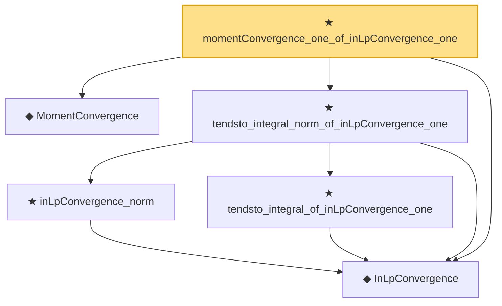

# Proof narrative — momentConvergence_one_of_inLpConvergence_one

Root: **momentConvergence_one_of_inLpConvergence_one** (theorem) `Statlib/StatFoundation/Convergence/AnalysisTools/IntegralConvergence.lean:249` · topic `StatFoundation`
Closure: 6 declarations across 2 files. Generated from `proof_graph.json` — no files were moved.

Reading order (foundations first, headline last):

  ◆ `InLpConvergence` — def · `Statlib/StatFoundation/Convergence/AnalysisTools/ConvergenceModes.lean:77`  _(also used by 65: inLpConvergence_congr_left, inLpConvergence_congr_right, inLpConvergence_congr, …)_
  ◆ `MomentConvergence` — def · `Statlib/StatFoundation/Convergence/AnalysisTools/ConvergenceModes.lean:113`  _(also used by 7: momentConvergence_one_of_inProbabilityConvergence_of_isUniformIntegrable, tendsto_integral_norm_rpow_two_of_momentConvergence_two, momentConvergence_two_of_tendsto_integral_norm_rpow_two, …)_
    ★ `inLpConvergence_norm` — theorem · `Statlib/StatFoundation/Convergence/AnalysisTools/IntegralConvergence.lean:209`
    ★ `tendsto_integral_of_inLpConvergence_one` — theorem · `Statlib/StatFoundation/Convergence/AnalysisTools/IntegralConvergence.lean:23`  _(also used by 4: tendsto_integral_sub_zero_of_inLpConvergence_one, tendsto_integral_of_inProbabilityConvergence_of_isUniformIntegrable, tendsto_integral_continuousLinearMap_of_inLpConvergence_one, …)_
  ★ `tendsto_integral_norm_of_inLpConvergence_one` — theorem · `Statlib/StatFoundation/Convergence/AnalysisTools/IntegralConvergence.lean:232`  _(also used by 1: tendsto_integral_norm_of_inProbabilityConvergence_of_isUniformIntegrable)_
★ `momentConvergence_one_of_inLpConvergence_one` — theorem · `Statlib/StatFoundation/Convergence/AnalysisTools/IntegralConvergence.lean:249` **← headline**

## Dependency diagram

