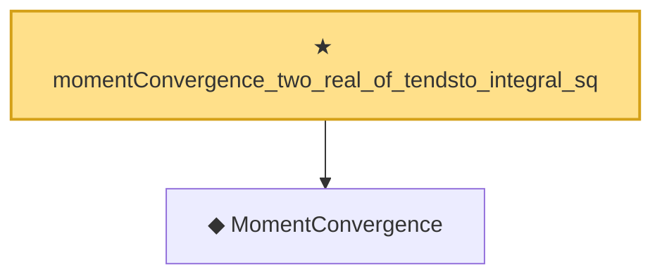

# Proof narrative — momentConvergence_two_real_of_tendsto_integral_sq

Root: **momentConvergence_two_real_of_tendsto_integral_sq** (theorem) `Statlib/StatFoundation/Convergence/AnalysisTools/IntegralConvergence.lean:329` · topic `StatFoundation`
Closure: 2 declarations across 2 files. Generated from `proof_graph.json` — no files were moved.

Reading order (foundations first, headline last):

  ◆ `MomentConvergence` — def · `Statlib/StatFoundation/Convergence/AnalysisTools/ConvergenceModes.lean:113`  _(also used by 7: momentConvergence_one_of_inLpConvergence_one, momentConvergence_one_of_inProbabilityConvergence_of_isUniformIntegrable, tendsto_integral_norm_rpow_two_of_momentConvergence_two, …)_
★ `momentConvergence_two_real_of_tendsto_integral_sq` — theorem · `Statlib/StatFoundation/Convergence/AnalysisTools/IntegralConvergence.lean:329` **← headline**

## Dependency diagram

