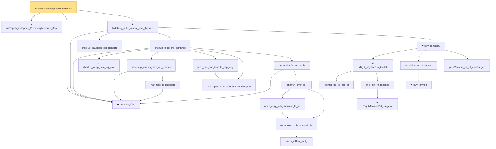

# Proof narrative — multiplierBootstrap_conditional_clt

Root: **multiplierBootstrap_conditional_clt** (theorem) `Statlib/StatFoundation/Convergence/Resampling/BootstrapInterface.lean:814` · topic `StatFoundation`
Closure: 24 declarations across 5 files. Generated from `proof_graph.json` — no files were moved.

Reading order (foundations first, headline last):

  ▸ `instTopologicalSpace_ProbabilityMeasure_Real` — instance · `Statlib/StatFoundation/Convergence/Resampling/BootstrapInterface.lean:805`
  ◆ `LindebergSum` — def · `Statlib/StatFoundation/Convergence/CentralLimitTheorem/LindebergFeller.lean:25`  _(also used by 9: tendstoInDistribution_debiasedLasso_scaledCenteredCoordinate_of_lindeberg_feller_scoreArray_and_l1_rowApprox_real, tendstoInDistribution_studentizedDebiasedLasso_coordinate_of_lindeberg_feller_scoreArray_l1_rowApprox_and_se_real, tendstoInDistribution_debiasedLasso_scaledCenteredCoordinate_of_lyapunov_scoreArray_and_l1_rowApprox_real, …)_
    · `charFun_gaussianReal_standard` — lemma · `Statlib/StatFoundation/Convergence/AnalysisTools/CharacteristicFunction.lean:272`  _(also used by 1: charfun_normalized_sum_bound)_
      · `charfun_indep_sum_eq_prod` — lemma · `Statlib/StatFoundation/Convergence/CentralLimitTheorem/LindebergFeller.lean:34`
        · `var_ratio_le_lindeberg` — lemma · `Statlib/StatFoundation/Convergence/CentralLimitTheorem/LindebergFeller.lean:274`
      · `lindeberg_implies_max_var_tendsto` — lemma · `Statlib/StatFoundation/Convergence/CentralLimitTheorem/LindebergFeller.lean:327`
      · `norm_prod_sub_prod_le_sum_mul_pow` — lemma · `Statlib/StatFoundation/Convergence/AnalysisTools/CharacteristicFunction.lean:227`
      · `prod_one_sub_tendsto_exp_neg` — lemma · `Statlib/StatFoundation/Convergence/CentralLimitTheorem/LindebergFeller.lean:379`
            · `norm_ofReal_mul_I` — lemma · `Statlib/StatFoundation/Convergence/AnalysisTools/CharacteristicFunction.lean:16`  _(also used by 1: norm_cexp_sub_quadratic_le_third)_
          · `norm_cexp_sub_quadratic_le` — lemma · `Statlib/StatFoundation/Convergence/AnalysisTools/CharacteristicFunction.lean:22`  _(also used by 1: charfun_taylor_third_moment)_
          · `norm_cexp_sub_quadratic_le_sq` — lemma · `Statlib/StatFoundation/Convergence/CentralLimitTheorem/LindebergFeller.lean:79`
        · `charfun_error_le_j` — lemma · `Statlib/StatFoundation/Convergence/CentralLimitTheorem/LindebergFeller.lean:110`
      · `sum_charfun_errors_le` — lemma · `Statlib/StatFoundation/Convergence/CentralLimitTheorem/LindebergFeller.lean:243`
    ★ `charfun_lindeberg_pointwise` — theorem · `Statlib/StatFoundation/Convergence/CentralLimitTheorem/LindebergFeller.lean:475`
        · `compl_Icc_eq_abs_gt` — lemma · `Statlib/StatFoundation/Convergence/AnalysisTools/LevyContinuity.lean:15`
          ★ `isTightMeasureSet_singleton` — theorem · `Statlib/StatFoundation/Convergence/AnalysisTools/Tightness.lean:113`  _(also used by 1: isTightMeasureSet_finiteRange)_
        ★ `isTight_finiteRange` — theorem · `Statlib/StatFoundation/Convergence/AnalysisTools/Tightness.lean:18`  _(also used by 1: isTightMeasureSet_range_map_of_isBigOInProbability_one_real)_
      ★ `isTight_of_charFun_tendsto` — theorem · `Statlib/StatFoundation/Convergence/AnalysisTools/LevyContinuity.lean:44`  _(also used by 1: isTight_of_charFun_tendsto_inner)_
        ★ `levy_forward` — theorem · `Statlib/StatFoundation/Convergence/AnalysisTools/LevyContinuity.lean:31`  _(also used by 1: cramer_wold_reverse)_
      · `charFun_eq_of_subseq` — lemma · `Statlib/StatFoundation/Convergence/AnalysisTools/LevyContinuity.lean:168`
      · `probMeasure_eq_of_charFun_eq` — lemma · `Statlib/StatFoundation/Convergence/AnalysisTools/LevyContinuity.lean:180`  _(also used by 3: t_statistic_asymptotic_normal, z_statistic_asymptotic_normal, tendstoInDistribution_of_probabilityMeasure_tendsto_and_gaussianReal_charFun)_
    ★ `levy_continuity` — theorem · `Statlib/StatFoundation/Convergence/AnalysisTools/LevyContinuity.lean:223`  _(also used by 1: iid_central_limit_theorem)_
  ★ `lindeberg_feller_central_limit_theorem` — theorem · `Statlib/StatFoundation/Convergence/CentralLimitTheorem/LindebergFeller.lean:675`  _(also used by 4: tendstoInDistribution_debiasedLasso_scaledCenteredCoordinate_of_lindeberg_feller_scoreArray_and_l1_rowApprox_real, tendstoInDistribution_studentizedDebiasedLasso_coordinate_of_lindeberg_feller_scoreArray_l1_rowApprox_and_se_real, tendstoInDistribution_debiasedLasso_scaledCenteredCoordinate_of_lyapunov_scoreArray_and_l1_rowApprox_real, …)_
★ `multiplierBootstrap_conditional_clt` — theorem · `Statlib/StatFoundation/Convergence/Resampling/BootstrapInterface.lean:814` **← headline**

## Dependency diagram

