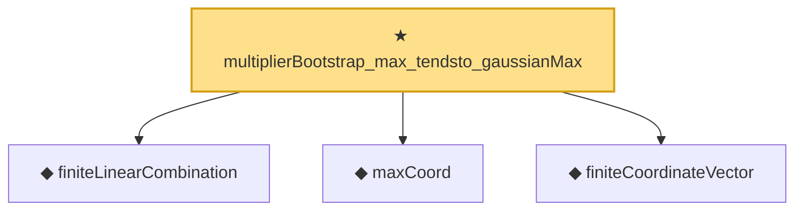

# Proof narrative — multiplierBootstrap_max_tendsto_gaussianMax

Root: **multiplierBootstrap_max_tendsto_gaussianMax** (theorem) `Statlib/StatFoundation/Convergence/Resampling/BootstrapInterface.lean:1175` · topic `StatFoundation`
Closure: 4 declarations across 3 files. Generated from `proof_graph.json` — no files were moved.

Reading order (foundations first, headline last):

  ◆ `finiteLinearCombination` — noncomputable abbrev · `Statlib/StatFoundation/Vocabulary/FiniteCoordinate.lean:29`  _(also used by 18: tendstoInDistribution_debiasedLasso_scaledCenteredFiniteCoordinate_of_linearScore_and_l1_rowApprox_real, hasFiniteLinearCombinationIsBigOInProbability_of_coordinatewise_real, hasFiniteLinearCombinationIsLittleOInProbability_of_coordinatewise_real, …)_
  ◆ `maxCoord` — noncomputable def · `Statlib/StatFoundation/Vocabulary/MaxType.lean:34`  _(also used by 12: smoothMax_bounds_max_log_card, maxCoord_measurable, maxCoord_lipschitz, …)_
  ◆ `finiteCoordinateVector` — noncomputable abbrev · `Statlib/StatFoundation/Vocabulary/FiniteCoordinate.lean:25`  _(also used by 21: tendstoInDistribution_debiasedLasso_scaledCenteredFiniteCoordinate_of_linearScore_and_l1_rowApprox_real, tendstoInDistribution_debiasedLasso_scaledCenteredFiniteCoordinate_of_scoreVector_and_l1_rowApprox_real, tendstoInDistribution_studentizedDebiasedLasso_coordinate_of_scoreVector_l1_rowApprox_and_se_real, …)_
★ `multiplierBootstrap_max_tendsto_gaussianMax` — theorem · `Statlib/StatFoundation/Convergence/Resampling/BootstrapInterface.lean:1175` **← headline**

## Dependency diagram

