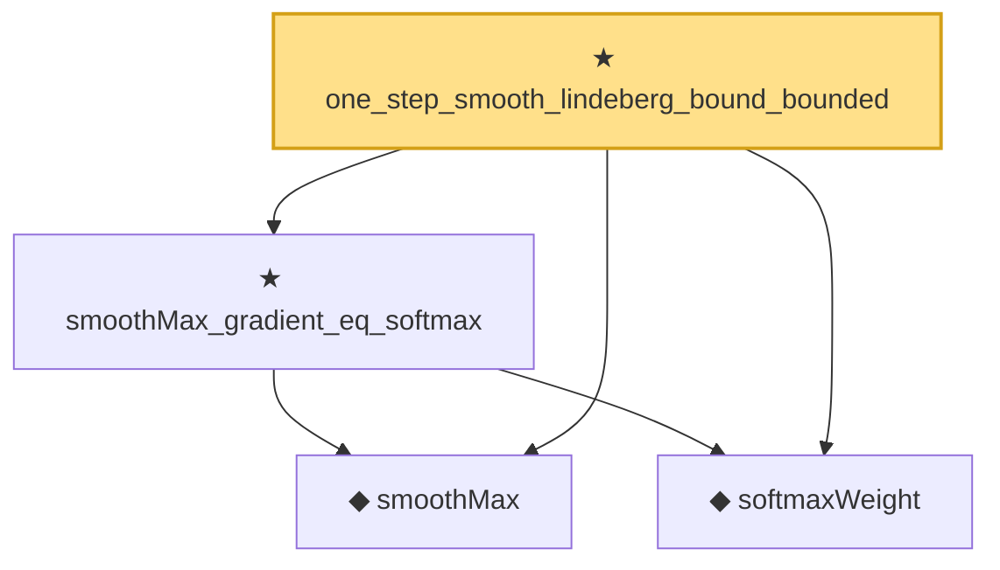

# Proof narrative — one_step_smooth_lindeberg_bound_bounded

Root: **one_step_smooth_lindeberg_bound_bounded** (theorem) `Statlib/StatFoundation/Convergence/AnalysisTools/SmoothComparison.lean:35` · topic `StatFoundation`
Closure: 4 declarations across 2 files. Generated from `proof_graph.json` — no files were moved.

Reading order (foundations first, headline last):

  ◆ `smoothMax` — noncomputable def · `Statlib/StatFoundation/Convergence/AnalysisTools/SmoothMax.lean:37`  _(also used by 4: smoothMax_def_measurable_continuous, smoothMax_bounds_max_log_card, smoothMax_hessian_bounds, …)_
  ◆ `softmaxWeight` — noncomputable def · `Statlib/StatFoundation/Convergence/AnalysisTools/SmoothMax.lean:42`  _(also used by 3: softmax_weights_sum_nonneg, smoothMax_hessian_bounds, smoothMax_third_derivative_bounds)_
  ★ `smoothMax_gradient_eq_softmax` — theorem · `Statlib/StatFoundation/Convergence/AnalysisTools/SmoothMax.lean:173`  _(also used by 2: smoothMax_hessian_bounds, smoothMax_third_derivative_bounds)_
★ `one_step_smooth_lindeberg_bound_bounded` — theorem · `Statlib/StatFoundation/Convergence/AnalysisTools/SmoothComparison.lean:35` **← headline**

## Dependency diagram

