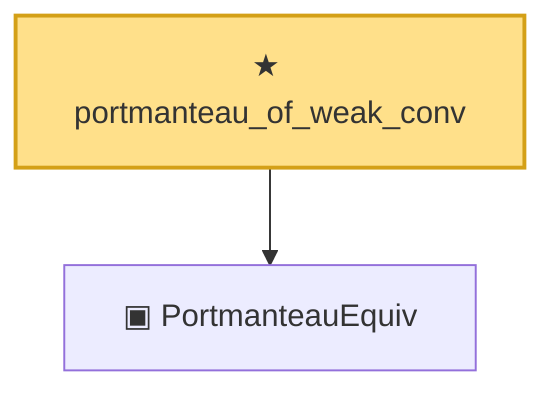

# Proof narrative — portmanteau_of_weak_conv

Root: **portmanteau_of_weak_conv** (theorem) `Statlib/StatFoundation/Convergence/AnalysisTools/ConvergenceModes.lean:296` · topic `StatFoundation`
Closure: 2 declarations across 1 files. Generated from `proof_graph.json` — no files were moved.

Reading order (foundations first, headline last):

  ▣ `PortmanteauEquiv` — structure · `Statlib/StatFoundation/Convergence/AnalysisTools/ConvergenceModes.lean:266`
★ `portmanteau_of_weak_conv` — theorem · `Statlib/StatFoundation/Convergence/AnalysisTools/ConvergenceModes.lean:296` **← headline**

## Dependency diagram

