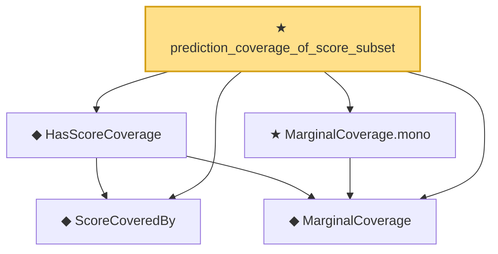

# Proof narrative — prediction_coverage_of_score_subset

Root: **prediction_coverage_of_score_subset** (theorem) `Statlib/StatFoundation/Statistics/Conformal.lean:32` · topic `StatFoundation`
Closure: 5 declarations across 2 files. Generated from `proof_graph.json` — no files were moved.

Reading order (foundations first, headline last):

  ◆ `ScoreCoveredBy` — def · `Statlib/StatFoundation/Vocabulary/Conformal.lean:27`
  ◆ `MarginalCoverage` — def · `Statlib/StatFoundation/Vocabulary/Conformal.lean:17`
  ◆ `HasScoreCoverage` — def · `Statlib/StatFoundation/Vocabulary/Conformal.lean:35`
  ★ `MarginalCoverage.mono` — theorem · `Statlib/StatFoundation/Statistics/Conformal.lean:16`
★ `prediction_coverage_of_score_subset` — theorem · `Statlib/StatFoundation/Statistics/Conformal.lean:32` **← headline**

## Dependency diagram

