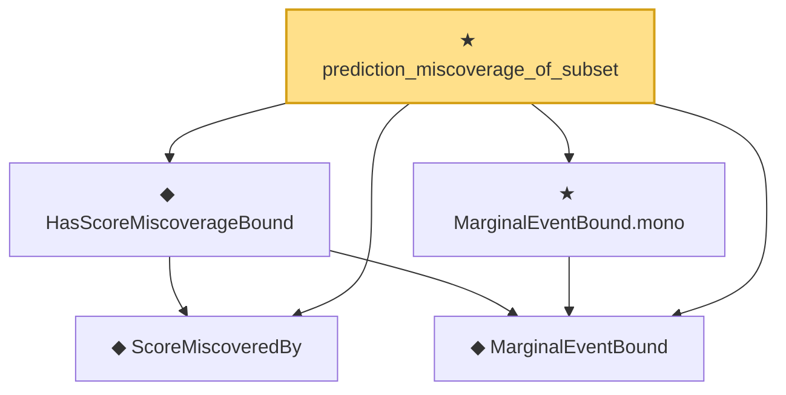

# Proof narrative — prediction_miscoverage_of_subset

Root: **prediction_miscoverage_of_subset** (theorem) `Statlib/StatFoundation/Statistics/Conformal.lean:42` · topic `StatFoundation`
Closure: 5 declarations across 2 files. Generated from `proof_graph.json` — no files were moved.

Reading order (foundations first, headline last):

  ◆ `ScoreMiscoveredBy` — def · `Statlib/StatFoundation/Vocabulary/Conformal.lean:31`
  ◆ `MarginalEventBound` — def · `Statlib/StatFoundation/Vocabulary/Conformal.lean:22`
  ◆ `HasScoreMiscoverageBound` — def · `Statlib/StatFoundation/Vocabulary/Conformal.lean:40`
  ★ `MarginalEventBound.mono` — theorem · `Statlib/StatFoundation/Statistics/Conformal.lean:24`
★ `prediction_miscoverage_of_subset` — theorem · `Statlib/StatFoundation/Statistics/Conformal.lean:42` **← headline**

## Dependency diagram

